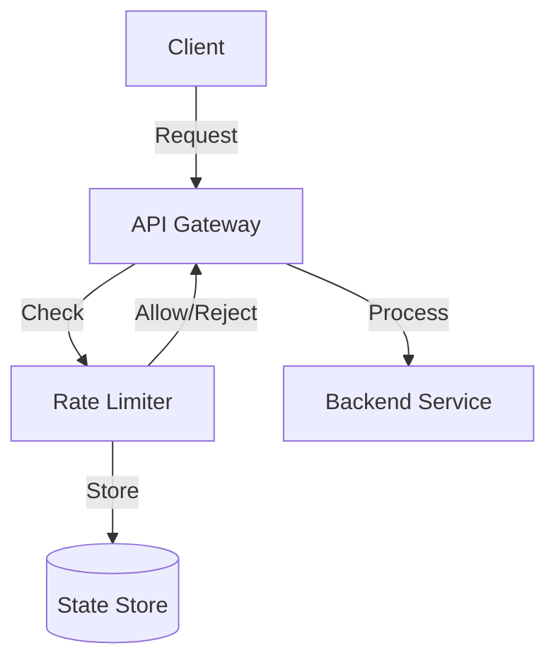

# API Rate Limiter: Interview Study Guide

## 1. Conceptual Overview
An API rate limiter restricts the number of requests a client can make in a given time window, protecting resources and ensuring fair usage.

---

## 2. Requirements & Constraints
- Limit requests per user/IP/key
- Configurable limits (e.g., 100 requests/minute)
- Fast response (O(1) or O(log n))
- Support multiple algorithms (fixed window, sliding window, token bucket, leaky bucket)
- Thread-safe and scalable
- Distributed support

---

## 3. High-Level Architecture Diagram


---

## 4. Core Components & Data Flow
- **API Gateway:** Entry point for requests
- **Rate Limiter:** Checks and enforces limits
- **State Store:** Stores counters/tokens
- **Backend Service:** Processes allowed requests

---

## 5. Example Walkthrough
1. Client sends request
2. API gateway forwards to rate limiter
3. Limiter checks state, allows/rejects
4. Allowed requests processed by backend

---

## 6. Key Algorithms & Data Structures
### Token Bucket (Python)
```python
import time
class TokenBucket:
    def __init__(self, capacity, refill_rate):
        self.capacity = capacity
        self.tokens = capacity
        self.refill_rate = refill_rate
        self.last_refill = time.time()
    def allow_request(self):
        now = time.time()
        elapsed = now - self.last_refill
        refill = int(elapsed * self.refill_rate)
        if refill > 0:
            self.tokens = min(self.capacity, self.tokens + refill)
            self.last_refill = now
        if self.tokens > 0:
            self.tokens -= 1
            return True
        return False
```

---

## 7. Scaling, Reliability, and Trade-offs
- **Scalability:** Use distributed store (Redis), partition by key
- **Reliability:** Replicate state, monitor health
- **Accuracy vs Performance:** Choose algorithm based on needs

---

## 8. Common Interview Questions


**How to scale rate limiting in distributed systems?**
- Use a distributed cache (e.g., Redis) to store counters/tokens for all clients.
- Partition keys by user/IP to distribute load and avoid bottlenecks.
- Replicate state across nodes for high availability and failover.
- Use atomic operations (e.g., Redis INCR, Lua scripts) to ensure consistency.

**How to prevent race conditions?**
- Use atomic operations in the data store to update counters safely.
- Apply distributed locks if multiple processes may update the same key.
- Design algorithms to be idempotent and resilient to retries.

**How to support burst traffic?**
- Use token bucket or leaky bucket algorithms to allow short bursts while enforcing average rate limits.
- Set burst capacity based on expected traffic patterns.
- Monitor usage and adjust limits dynamically if needed.

**How to persist state for recovery?**
- Store counters/tokens in a persistent database or distributed cache with backup.
- Periodically snapshot state to disk or cloud storage.
- On recovery, reload state from snapshots and resume limiting.

**How to choose between algorithms?**
- Fixed window: Simple, but can allow bursts at window boundaries.
- Sliding window: More accurate, but higher memory usage.
- Token bucket: Allows bursts, good for APIs with variable traffic.
- Leaky bucket: Smooths out traffic, good for steady rate enforcement.

---

## 9. Real-World Use Cases
- API gateways, login throttling, payment systems

---

## 10. Tips for Interviews
- Draw architecture and algorithm diagrams
- Walk through request limiting flows
- Discuss trade-offs (accuracy, performance)
- Mention distributed challenges

---

## 11. Further Reading
- [Rate Limiting Algorithms](https://cloud.google.com/architecture/rate-limiting-apis)
- [Token Bucket Algorithm](https://en.wikipedia.org/wiki/Token_bucket)
- [System Design Primer](https://github.com/donnemartin/system-design-primer)

---

**Practice, visualize, and explain clearly—this will make you interview ready!**
