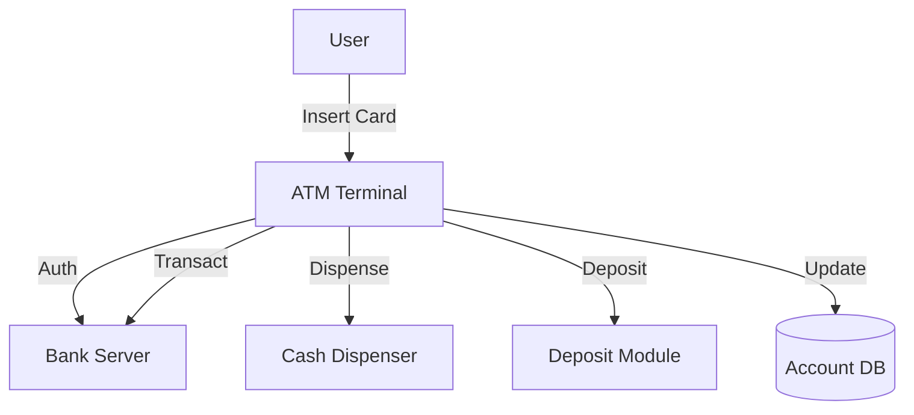

# ATM System: Interview Study Guide

## 1. Conceptual Overview
An ATM system allows users to withdraw, deposit, and check account balances securely. Must be reliable, available, and handle transactions safely.

---

## 2. Requirements & Constraints
- User authentication (card, PIN)
- Withdraw, deposit, balance inquiry
- Transaction management
- Cash dispensing and deposit
- Error handling (timeouts, insufficient funds)
- Security and reliability

---

## 3. High-Level Architecture Diagram



---

## 4. Core Components & Data Flow
- **ATM Terminal:** User interface, card reader
- **Bank Server:** Authenticates, processes transactions
- **Account DB:** Stores account info
- **Cash Dispenser/Deposit Module:** Handles cash

---

## 5. Example Walkthrough
1. User inserts card, enters PIN
2. ATM authenticates with bank server
3. User requests withdrawal
4. Bank server checks balance, approves
5. ATM dispenses cash, updates account

---

## 6. Key Algorithms & Data Structures
### Transaction Management
- Use ACID properties for safety

### Error Handling
```python
# Pseudocode for withdrawal
if balance >= amount:
    balance -= amount
    dispense_cash(amount)
else:
    show_error('Insufficient funds')
```

---

## 7. Scaling, Reliability, and Trade-offs
- **Reliability:** Replicate DB, monitor ATM health
- **Availability:** Multiple ATMs, failover
- **Security:** Encrypt data, secure PIN entry

---

## 8. Common Interview Questions

**How to handle transaction failures?**
- Implement ACID properties for all transactions to ensure atomicity and consistency.
- Use transaction logs to roll back incomplete or failed transactions.
- Detect failures (network, hardware, insufficient funds) and provide clear error messages to users.
- Retry transient failures and escalate persistent issues to bank staff.

**How to ensure security?**
- Encrypt all sensitive data (PIN, account info) during transmission and storage.
- Use secure hardware modules for PIN entry and card reading.
- Implement multi-factor authentication (card + PIN).
- Regularly update software and firmware to patch vulnerabilities.
- Monitor for suspicious activity and enforce rate limits on failed login attempts.

**How to scale for many ATMs?**
- Use a distributed architecture with load balancers and replicated databases.
- Deploy ATMs in clusters, each connected to regional servers for lower latency.
- Monitor ATM health and automate failover to backup servers.
- Use cloud infrastructure for dynamic scaling during peak times.

**How to handle cash reconciliation?**
- Track all cash transactions in real-time and log them in the central database.
- Perform daily reconciliation between ATM cash inventory and transaction logs.
- Use sensors to detect cash jams or discrepancies.
- Automate alerts for mismatches and require manual review for unresolved issues.


## 9. Real-World Use Cases
- Bank ATMs, retail cash machines

---

## 10. Tips for Interviews
- Draw architecture and data flow diagrams
- Walk through withdrawal/deposit flows
- Discuss transaction safety, error handling  
  Transaction safety ensures that all ATM operations (like withdrawals, deposits, or transfers) are completed fully or not at all. This is often achieved using the ACID properties (Atomicity, Consistency, Isolation, Durability) in database transactions. Error handling involves detecting and managing issues such as network failures, incorrect PIN entries, or insufficient funds. Proper error handling prevents data corruption and provides clear feedback to users.

- Mention trade-offs (security, reliability)  
  ATM systems must balance security and reliability. Strong security measures (like encryption, multi-factor authentication, and strict access controls) protect against fraud and unauthorized access but may introduce complexity or slow down transactions. High reliability ensures the ATM is available and accurate, but redundancy and failover mechanisms can increase costs. Designing an ATM system involves making trade-offs between these factors to meet business and user needs.

---

## 11. Further Reading
- [ATM System Design](https://www.geeksforgeeks.org/system-design/design-atm-system/)
- [ACID Properties](https://en.wikipedia.org/wiki/ACID)

---

**Practice, visualize, and explain clearly—this will make you interview ready!**
