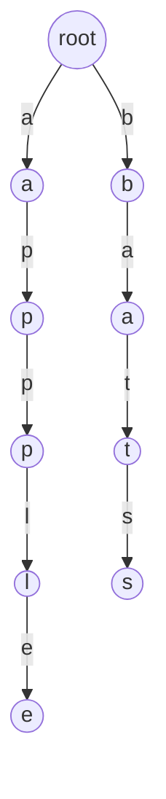

# Autocomplete / Search-as-You-Type System: Complete Study Guide for Interviews

## 1. What is an Autocomplete System?
An autocomplete (search-as-you-type) system suggests possible completions for a user's input in real time. It is used in search engines, code editors, messaging apps, and more.

---

## 2. Why is it Important in Interviews?
- Tests your knowledge of data structures (Trie, HashMap, Heap)
- Assesses your ability to design scalable, low-latency systems
- Common in LLD/System Design interviews

---

## 3. Core Requirements
- Suggest top-k completions for a given prefix as the user types
- Fast response (real-time, <100ms)
- Support for ranking (by frequency, recency, or relevance)
- Efficient memory usage
- Support for dynamic updates (add/remove suggestions)

---

## 4. Key Data Structures
- **Trie (Prefix Tree):** Efficiently stores and searches prefixes
- **HashMap:** Maps words to frequency or metadata
- **Heap/Priority Queue:** Maintains top-k suggestions

### Diagram: Trie Structure

*Example: Trie for words "apple" and "bats"*

---

## 5. Autocomplete Operations Explained
### insert(word, freq)
- Add word to Trie, update frequency in HashMap

### search(prefix, k)
- Traverse Trie to node for prefix
- Use DFS/BFS/Heap to collect top-k completions ranked by frequency

---

## 6. Example Walkthrough
Assume dictionary: ["apple", "app", "ape", "bat", "bats"]

| User Types | Suggestions (Top-2 by freq) |
|------------|-----------------------------|
| a          | app, apple                  |
| ap         | app, apple                  |
| app        | app, apple                  |
| b          | bat, bats                   |
| ba         | bat, bats                   |

---

## 7. Python Implementation (Simplified)
```python
class TrieNode:
    def __init__(self):
        self.children = {}
        self.is_end = False
        self.freq = 0

class AutocompleteSystem:
    def __init__(self):
        self.root = TrieNode()
        self.freq_map = {}

    def insert(self, word, freq=1):
        node = self.root
        for c in word:
            if c not in node.children:
                node.children[c] = TrieNode()
            node = node.children[c]
        node.is_end = True
        node.freq += freq
        self.freq_map[word] = node.freq

    def search(self, prefix, k=3):
        node = self.root
        for c in prefix:
            if c not in node.children:
                return []
            node = node.children[c]
        result = []
        def dfs(n, path):
            if n.is_end:
                result.append(("".join(path), n.freq))
            for ch, child in n.children.items():
                dfs(child, path + [ch])
        dfs(node, list(prefix))
        result.sort(key=lambda x: -x[1])
        return [w for w, _ in result[:k]]
```

---

## 8. Scaling for Production
- **Sharding:** Partition Trie by first letter or hash
- **Caching:** Store hot prefixes in memory
- **Asynchronous Updates:** Use queues for real-time updates
- **Distributed Systems:** Use microservices, load balancers
- **Persistence:** Store Trie/frequency data in DB for recovery

---

## 9. Common Interview Questions
- **How do you handle typos (fuzzy search)?**  
    Use algorithms like Levenshtein Distance or edit distance to find words within a certain number of character changes from the input. Implement Trie-based fuzzy search with backtracking, or use BK-Trees for efficient approximate matching.

- **How to support dynamic updates (add/remove words)?**  
    For adding, insert the word into the Trie and update frequency maps. For removal, mark the word as deleted in the Trie (set `is_end = False`) and update or remove from frequency maps. Periodically clean up unused nodes for memory efficiency.

- **How to rank by recency or context?**  
    Maintain additional metadata (e.g., last used timestamp, user/session context) for each word. Use a combination of frequency and recency (e.g., LRU cache, time decay functions) to rank suggestions. For context, track previous queries or user behavior to personalize results.

- **How to scale for millions of users?**  
    Partition data (sharding) by prefix or user segment. Use distributed caches for hot prefixes. Employ load balancers and microservices for horizontal scaling. Persist Trie and metadata in scalable databases (e.g., NoSQL, distributed key-value stores) and use asynchronous processing for updates.

---

## 10. Tips for Interviews
- Draw Trie diagrams to explain your approach
- Walk through an example with the interviewer
- Discuss trade-offs (memory vs. speed, Trie vs. HashMap)
  - Tries are tree-like data structures optimized for prefix-based searches, making them very fast for autocomplete tasks. However, they can consume more memory, especially if the dataset contains many unique prefixes or sparse data.
  - HashMaps are efficient for exact lookups and use less memory for sparse datasets, but they are not optimized for prefix searches, making them slower for autocomplete scenarios.
  - Choosing between Trie and HashMap depends on your application's needs: prioritize Tries for fast prefix queries, or HashMaps for memory efficiency and exact matches.

- Mention real-world use cases (Google search, IDEs)
  - Autocomplete is widely used in search engines like Google to suggest queries as users type, improving user experience and efficiency.
  - Integrated Development Environments (IDEs) use autocomplete to suggest code completions, helping developers write code faster and with fewer errors.

---

## 11. Further Reading
- [Autocomplete System - LeetCode](https://leetcode.com/problems/design-search-autocomplete-system/)
- [Trie Data Structure](https://en.wikipedia.org/wiki/Trie)
- [System Design Primer](https://github.com/donnemartin/system-design-primer)

---

**Practice, visualize, and explain clearly—this will make you interview ready!**
