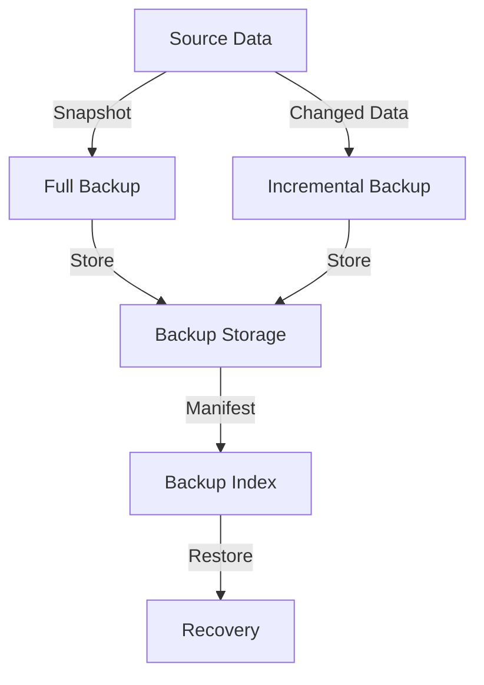

# Backup System: Complete Study Guide for Interviews

## 1. What is a Backup System?
A backup system creates copies of data to protect against loss, corruption, or disasters. It enables recovery of files, databases, or entire systems to a previous state.

---

## 2. Why is Backup System Design Important in Interviews?
- Tests your understanding of reliability, redundancy, and data integrity
- Assesses ability to design scalable, fault-tolerant systems
- Common in system design, cloud, and infrastructure interviews

---

## 3. Core Requirements
- Support for full and incremental backups
- Scheduling and automation
- Efficient storage and deduplication
- Restore/recovery operations
- Versioning and retention policies
- Security (encryption, access control)
- Monitoring and alerting

---

## 4. Key Concepts & Data Structures
- **Snapshot:** Point-in-time copy of data
- **Incremental Backup:** Only changed data since last backup
- **Deduplication:** Store only unique data blocks
- **Manifest/Index:** Tracks files, versions, and backup metadata
- **Scheduler:** Automates backup jobs

### Diagram: Backup Workflow

*Full and incremental backups are stored and indexed for recovery.*

---

## 5. Backup System Operations Explained
### create_backup(type)
- Full: Copy all data
- Incremental: Copy only changed data since last backup
- Update manifest/index

### restore(version)
- Locate backup in manifest
- Retrieve and reconstruct data

### schedule_backup(time, type)
- Set up automated backup jobs

### deduplicate()
- Identify and remove duplicate data blocks

---

## 6. Example Walkthrough
Assume files: file1.txt, file2.txt
- Day 1: Full backup (both files)
- Day 2: file2.txt changed → incremental backup (only file2.txt)
- Restore Day 2: recover file1.txt from full, file2.txt from incremental

---

## 7. Python Implementation (Simplified)
```python
import time
class BackupSystem:
    def __init__(self):
        self.storage = {}
        self.manifest = {}
    def create_backup(self, files, backup_type):
        timestamp = time.time()
        backup = {}
        if backup_type == 'full':
            for f, content in files.items():
                backup[f] = content
        elif backup_type == 'incremental':
            last = self.manifest[max(self.manifest)] if self.manifest else {}
            for f, content in files.items():
                if f not in last or last[f] != content:
                    backup[f] = content
        self.storage[timestamp] = backup
        self.manifest[timestamp] = backup
    def restore(self, timestamp):
        return self.storage.get(timestamp, {})
```

---

## 8. Common Interview Questions
### How do you optimize for large datasets?
- Use deduplication and compression to reduce storage usage
- Implement incremental and differential backups
- Parallelize backup and restore operations
- Use efficient data structures for indexing and tracking changes

### How to support distributed backups?
- Use distributed storage systems (e.g., cloud object stores, distributed file systems)
- Coordinate backup jobs across nodes using a central scheduler or consensus protocol
- Ensure metadata consistency across distributed components

### How to ensure consistency and atomicity?
- Use snapshot mechanisms to capture point-in-time data
- Apply transactional techniques (e.g., write-ahead logs) for atomic operations
- Lock or quiesce data sources during backup to prevent partial copies

### How to handle backup failures?
- Implement retry logic and error handling in backup jobs
- Monitor backup processes and alert on failures
- Store backup logs for troubleshooting and auditing
- Design for partial recovery and resume interrupted backups

### How to secure backup data?
- Encrypt data at rest and in transit
- Use access controls and authentication for backup operations
- Regularly audit backup storage and permissions

### How to implement retention and versioning policies?
- Define rules for how long backups are kept (e.g., daily, weekly, monthly)
- Automatically delete expired backups based on policy
- Maintain version history in the manifest/index for easy rollback and recovery

---

## 9. Tips for Interviews
- Draw workflow diagrams to explain your approach
- Walk through an example with the interviewer
- Discuss trade-offs (speed vs. storage, full vs. incremental)
  - Full backups copy all data every time, which is slower and uses more storage, but makes restoring data straightforward.
  - Incremental backups only copy data that has changed since the last backup, saving time and storage space, but can make restores slower and more complex because multiple backup sets may be needed.
  - Choosing between these methods depends on how quickly you need backups to run and how much storage you can allocate.

- Mention real-world use cases (cloud backup, disaster recovery)
  - Cloud backup services often use incremental backups to minimize bandwidth and storage costs.
  - Disaster recovery plans rely on backups to restore systems after failures, so organizations may use full backups for critical data and incremental backups for less important files to balance speed and cost.
---

## 10. Further Reading
- [Backup - Wikipedia](https://en.wikipedia.org/wiki/Backup)
- [System Design Primer](https://github.com/donnemartin/system-design-primer)
- [Design Patterns: Command](https://refactoring.guru/design-patterns/command)

---

**Practice, visualize, and explain clearly—this will make you interview ready!**
