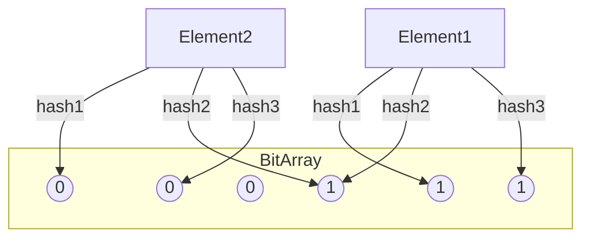

# Bloom Filter System: Complete Study Guide for Interviews

## 1. What is a Bloom Filter?
A Bloom Filter is a space-efficient probabilistic data structure used to test whether an element is a member of a set. It can return false positives but never false negatives. Widely used in databases, caching, and networking.

---

## 2. Why is Bloom Filter Important in Interviews?
- Tests your knowledge of hashing, bit manipulation, and probabilistic data structures
- Assesses ability to design memory-efficient systems
- Common in system design, backend, and database interviews

---

## 3. Core Requirements
- Fast insert and lookup operations (O(k), k = number of hash functions)
- Space-efficient (bit array)
- Configurable false positive rate
- No false negatives
- Support for merging filters

---

## 4. Key Concepts & Data Structures
- **Bit Array:** Main storage, each bit represents possible membership
- **Hash Functions:** Multiple independent hash functions map elements to bits
- **False Positives:** May report an element is present when it is not

### Diagram: Bloom Filter Structure

*Multiple hash functions set bits for each element.*

---

## 5. Bloom Filter Operations Explained
### add(element)
- Hash element with k hash functions
- Set corresponding bits in bit array

### contains(element)
- Hash element with k hash functions
- Check if all corresponding bits are set
- If yes, element may be present (false positive possible)
- If no, element is definitely not present

---

## 6. Example Walkthrough
Assume bit array of size 6, 3 hash functions
- Add "foo": hashes to bits 1, 3, 5 (set those bits)
- Add "bar": hashes to bits 0, 3, 4 (set those bits)
- Check "baz": hashes to bits 0, 1, 5
    - If all bits set, may be present; if any bit is 0, definitely not present

---

## 7. Python Implementation (Simplified)
```python
import mmh3, bitarray
class BloomFilter:
    def __init__(self, size, hash_count):
        self.size = size
        self.hash_count = hash_count
        self.bit_array = bitarray.bitarray(size)
        self.bit_array.setall(0)
    def add(self, item):
        for i in range(self.hash_count):
            idx = mmh3.hash(item, i) % self.size
            self.bit_array[idx] = 1
    def contains(self, item):
        for i in range(self.hash_count):
            idx = mmh3.hash(item, i) % self.size
            if self.bit_array[idx] == 0:
                return False
        return True
```

---

## 8. Scaling for Production
- **Tune size/hash count:** Balance memory usage and false positive rate
- **Distributed filters:** Merge filters from multiple nodes
- **Counting Bloom Filter:** Support deletions by counting bits
- **Persistence:** Store bit array in disk or distributed cache

---

## 9. Common Interview Questions
- **How do you choose size and number of hash functions?**  
    Use formulas based on expected number of elements (n) and desired false positive rate (p):  
    - Bit array size: `m = -(n * ln(p)) / (ln(2)^2)`
    - Number of hash functions: `k = (m/n) * ln(2)`

- **How to handle deletions (Counting Bloom Filter)?**  
    Use a counting Bloom Filter, which replaces bits with counters. Increment counters on insert, decrement on delete. Allows safe removal but uses more memory.

- **How to merge Bloom Filters?**  
    Merge by bitwise OR of bit arrays (for standard Bloom Filters). For counting Bloom Filters, add corresponding counters.

- **How to estimate false positive rate?**  
    Formula: `p = (1 - e^(-k * n / m))^k`  
    Where `k` = number of hash functions, `n` = inserted items, `m` = bit array size.

- **How to persist and recover filter state?**  
    Serialize the bit array (or counters) to disk or distributed storage. On recovery, load and reconstruct the Bloom Filter from stored data.

---

## 10. Tips for Interviews
- Draw bit array diagrams to explain your approach
- Walk through an example with the interviewer
- Discuss trade-offs (accuracy vs. memory)
  Bloom filters are space-efficient data structures used to test whether an element is a member of a set. The main trade-off is between memory usage and accuracy. Using less memory increases the probability of false positives (incorrectly reporting that an item is in the set), while allocating more memory reduces this probability. Bloom filters never produce false negatives, but you must balance memory constraints with acceptable error rates for your application.
- Mention real-world use cases (web cache, DB indexing)
  Bloom filters are widely used in scenarios where quick membership checks are needed and some false positives are acceptable. For example, web caches use Bloom filters to check if a URL is cached before performing expensive lookups. Databases use them for indexing and to avoid unnecessary disk reads by quickly checking if a record might exist. Other use cases include spell checkers, network security, and

---

## 11. Further Reading
- [Bloom Filter - Wikipedia](https://en.wikipedia.org/wiki/Bloom_filter)
- [Probabilistic Data Structures](https://github.com/tylertreat/BloomFilter)
- [System Design Primer](https://github.com/donnemartin/system-design-primer)

---

**Practice, visualize, and explain clearly—this will make you interview ready!**
