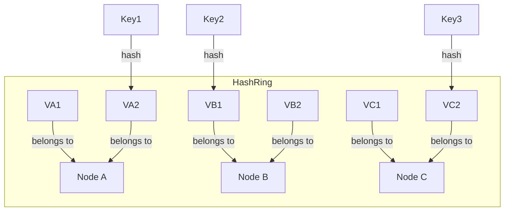

# Consistent Hashing System: Complete Study Guide for Interviews

## 1. What is Consistent Hashing?
Consistent Hashing is a technique used to distribute data across a dynamic set of nodes (servers, caches) such that minimal data is moved when nodes are added or removed. It is widely used in distributed systems, databases, and caching solutions.

---

## 2. Why is Consistent Hashing Important in Interviews?
- Tests your understanding of distributed systems and scalability
- Assesses ability to design fault-tolerant, elastic architectures
- Common in system design, backend, and cloud interviews

---

## 3. Core Requirements
- Evenly distribute keys/data across nodes
- Minimize data movement on node changes
- Support for virtual nodes (improves load balancing)
- Fast lookup and update operations
- Handle node failures gracefully

---

## 4. Key Concepts & Data Structures
- **Hash Ring:** Nodes and keys are mapped to points on a circle using a hash function
- **Virtual Nodes:** Each physical node is represented by multiple points on the ring for better load distribution
- **Mapping:** Each key is assigned to the first node clockwise on the ring

### Diagram: Hash Ring with Virtual Nodes

*Keys are mapped to virtual nodes, which belong to physical nodes.*

---

## 5. Consistent Hashing Operations Explained
### add_node(node)
- Add node and its virtual nodes to the ring
- Reassign keys as needed

### remove_node(node)
- Remove node and its virtual nodes from the ring
- Reassign affected keys to next node clockwise

### get_node(key)
- Hash key, find first node clockwise on ring

---

## 6. Example Walkthrough
Assume nodes: A, B, C (each with 2 virtual nodes)
- Key "foo" hashes to VA2 (belongs to A)
- Key "bar" hashes to VB1 (belongs to B)
- If B is removed, keys on VB1/VB2 move to next node (C)

---

## 7. Python Implementation (Simplified)
```python
import bisect, hashlib
class ConsistentHashRing:
    def __init__(self, nodes=None, vnodes=2):
        self.ring = []
        self.node_map = {}
        self.vnodes = vnodes
        if nodes:
            for node in nodes:
                self.add_node(node)
    def _hash(self, key):
        return int(hashlib.md5(key.encode()).hexdigest(), 16)
    def add_node(self, node):
        for i in range(self.vnodes):
            vkey = f"{node}-{i}"
            h = self._hash(vkey)
            bisect.insort(self.ring, h)
            self.node_map[h] = node
    def remove_node(self, node):
        for i in range(self.vnodes):
            vkey = f"{node}-{i}"
            h = self._hash(vkey)
            idx = bisect.bisect_left(self.ring, h)
            if idx < len(self.ring) and self.ring[idx] == h:
                self.ring.pop(idx)
                del self.node_map[h]
    def get_node(self, key):
        h = self._hash(key)
        idx = bisect.bisect(self.ring, h) % len(self.ring)
        return self.node_map[self.ring[idx]]
```

---

## 8. Scaling for Production
- **Virtual nodes:** Use more vnodes per physical node for better load balancing
- **Distributed state:** Use consistent hashing in distributed caches (e.g., Memcached, DynamoDB)
- **Replication:** Store copies of data on multiple nodes for fault tolerance
- **Monitoring:** Track node health and rebalance as needed

---

## 9. Common Interview Questions
- **How do you handle node failures?**  
    Monitor node health and automatically remove failed nodes from the ring. Reassign affected keys to the next available node clockwise. Use replication to ensure data availability even if a node fails.

- **How to rebalance data when adding/removing nodes?**  
    When a node is added, only the keys that map to its virtual nodes are reassigned. When a node is removed, its keys are reassigned to the next node clockwise. This minimizes data movement compared to traditional hashing.

- **How to choose hash function and number of virtual nodes?**  
    Use a fast, uniform hash function (e.g., MD5, SHA-1) to evenly distribute keys. The number of virtual nodes per physical node should be tuned based on the number of nodes and desired load balance—more virtual nodes improve distribution but increase management overhead.

- **How to support replication and sharding?**  
    Replicate each key to multiple consecutive nodes on the ring for fault tolerance. Sharding is achieved by distributing keys across nodes using the hash ring, ensuring even data spread.

- **How to persist ring state for recovery?**  
    Store the ring configuration (nodes, virtual nodes, mappings) in persistent storage (e.g., database, distributed config service). On restart or recovery, reload the ring state to maintain consistency and avoid data loss.

---

## 10. Tips for Interviews
- Draw hash ring diagrams to explain your approach
- Walk through an example with the interviewer
- Discuss trade-offs (load balancing vs. complexity)
  - **Load Balancing:** Consistent hashing helps distribute data evenly across nodes, reducing hotspots and improving scalability. When nodes are added or removed, only a small portion of keys need to be remapped, minimizing disruption.
  - **Complexity:** Implementing consistent hashing introduces additional complexity. It requires careful handling of hash functions, virtual nodes, and edge cases (like node failures). Debugging and maintaining such systems can be more challenging compared to simpler hashing schemes.

- Mention real-world use cases (distributed cache, sharded DB)
  - **Distributed Cache:** Systems like Memcached use consistent hashing to distribute cached objects across multiple servers. This ensures that cache lookups remain efficient even as servers are added or removed.
  - **Sharded Database:** Databases such as Cassandra and DynamoDB use consistent hashing to partition data across nodes. This allows for horizontal scaling and high availability, as data can be redistributed with minimal impact when the cluster

---

## 11. Further Reading
- [Consistent Hashing - Wikipedia](https://en.wikipedia.org/wiki/Consistent_hashing)
- [Dynamo: Amazon’s Highly Available Key-value Store](https://www.allthingsdistributed.com/2007/10/amazons_dynamo.html)
- [System Design Primer](https://github.com/donnemartin/system-design-primer)

---

**Practice, visualize, and explain clearly—this will make you interview ready!**
