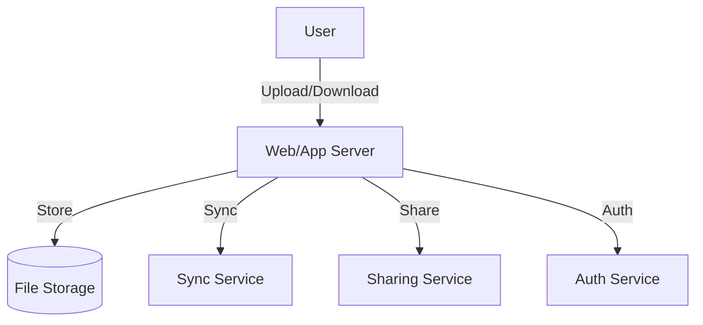

# Dropbox/Google Drive/Google Photos (File Storage & Sharing): Interview Study Guide

## 1. Conceptual Overview
A file storage and sharing service lets users upload, download, share, and sync files across devices. Must be reliable, scalable, and secure.

---

## 2. Requirements & Constraints
- Upload, download, delete, share files
- Sync across devices
- Support large files
- Versioning and conflict resolution
- Access control and permissions
- Scalability and reliability
- Security and privacy

---

## 3. High-Level Architecture Diagram



---

## 4. Core Components & Data Flow
- **Web/App Server:** Handles user requests
- **File Storage:** Stores files (object store, distributed FS)
- **Sync Service:** Syncs files across devices
- **Sharing Service:** Manages permissions, sharing
- **Auth Service:** Handles authentication

---

## 5. Example Walkthrough
1. User uploads file
2. File stored in distributed storage
3. Metadata updated in DB
4. Sync service updates other devices
5. User shares file; sharing service updates permissions

---

## 6. Key Algorithms & Data Structures
### Chunking for Large Files
- Split files into chunks for upload/download
- Only changed chunks synced

### Conflict Resolution
```python
# Pseudocode for versioning
versions = {}
def save(file_id, content):
    versions[file_id].append(content)
```

---

## 7. Scaling, Reliability, and Trade-offs
- **Scalability:** Use object storage, partition by user/file
- **Reliability:** Replicate files, backup
- **Sync:** Use event logs for device updates
- **Security:** Encrypt files, secure sharing

---

## 8. Common Interview Questions
- How to sync files across devices?
- How to handle large files?
- How to resolve conflicts?
- How to scale storage?
- How to secure files and sharing?

---

## 9. Real-World Use Cases
- Dropbox, Google Drive, OneDrive, Google Photos

---

## 10. Tips for Interviews
- Draw architecture and data flow diagrams
- Discuss chunking, sync, sharing
- Mention trade-offs (speed, reliability, security)
- Walk through upload/sync/share flows

---

## 11. Further Reading
- [Dropbox System Design](https://www.geeksforgeeks.org/system-design/design-dropbox-a-system-design-interview-question/)
- [Google Drive Architecture](https://www.geeksforgeeks.org/system-design/design-google-drive-system-design/)
- [File Sync Algorithms](https://en.wikipedia.org/wiki/File_synchronization)

---

**Practice, visualize, and explain clearly—this will make you interview ready!**
