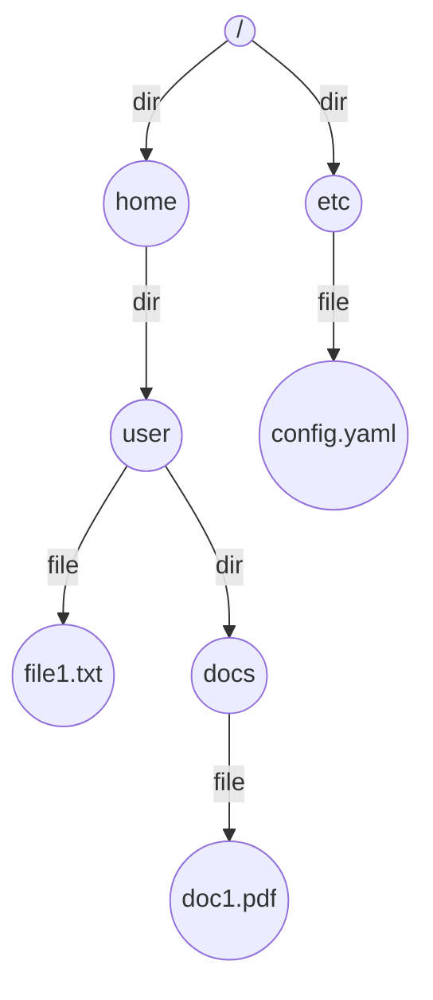

# Simple File System: Complete Study Guide for Interviews

## 1. What is a File System?
A file system organizes and manages files and directories on storage devices. It provides operations to create, read, update, and delete files, and supports hierarchical directory structures.

---

## 2. Why is File System Design Important in Interviews?
- Tests your understanding of data structures (trees, hash maps)
- Assesses ability to model real-world systems
- Common in LLD, OOP, and system design interviews

---

## 3. Core Requirements
- Hierarchical directory structure (folders within folders)
- File and directory operations: create, read, update, delete (CRUD)
- Path navigation (absolute/relative)
- Support for file metadata (size, timestamps)
- Efficient lookup and traversal

---

## 4. Key Concepts & Data Structures
- **Tree:** Directories and files are nodes in a tree
- **Hash Map:** Fast lookup of children by name
- **File/Directory Node:** Stores metadata and content

### Diagram: File System Tree

*Example: Hierarchical file system tree*

---

## 5. File System Operations Explained
### create(path, is_dir)
- Traverse tree to parent directory
- Add new file or directory node

### read(path)
- Traverse tree to node
- Return file content or directory listing

### update(path, content)
- Traverse tree to file node
- Update file content

### delete(path)
- Traverse tree to parent
- Remove file or directory node

---

## 6. Example Walkthrough
Assume file system:
- `/home/user/file1.txt`
- `/home/user/docs/doc1.pdf`
- `/etc/config.yaml`

| Operation         | Result                       |
|------------------|------------------------------|
| create("/home/user/file2.txt", False) | Adds file2.txt under /home/user |
| read("/home/user/docs")                | Lists doc1.pdf                  |
| update("/etc/config.yaml", "new")      | Updates config.yaml content     |
| delete("/home/user/file1.txt")         | Removes file1.txt               |

---

## 7. Python Implementation (Simplified)
```python
class Node:
    def __init__(self, name, is_dir):
        self.name = name
        self.is_dir = is_dir
        self.children = {} if is_dir else None
        self.content = "" if not is_dir else None

class FileSystem:
    def __init__(self):
        self.root = Node("/", True)
    def _traverse(self, path):
        parts = [p for p in path.strip("/").split("/") if p]
        node = self.root
        for p in parts:
            if not node.is_dir or p not in node.children:
                return None
            node = node.children[p]
        return node
    def create(self, path, is_dir):
        parts = [p for p in path.strip("/").split("/") if p]
        node = self.root
        for p in parts[:-1]:
            if p not in node.children:
                return None
            node = node.children[p]
        name = parts[-1]
        if name in node.children:
            return None
        node.children[name] = Node(name, is_dir)
    def read(self, path):
        node = self._traverse(path)
        if not node:
            return None
        if node.is_dir:
            return list(node.children.keys())
        return node.content
    def update(self, path, content):
        node = self._traverse(path)
        if node and not node.is_dir:
            node.content = content
    def delete(self, path):
        parts = [p for p in path.strip("/").split("/") if p]
        node = self.root
        for p in parts[:-1]:
            if p not in node.children:
                return None
            node = node.children[p]
        name = parts[-1]
        if name in node.children:
            del node.children[name]
```

---

## 8. Common Interview Questions
### How do you handle file permissions?
- Store permission metadata (read, write, execute) in each file/directory node.
- Check permissions before performing operations.
- Use user/group ownership for access control.

### How to support concurrent access?
- Implement locking mechanisms (e.g., read/write locks) on nodes.
- Use thread-safe data structures.
- Consider atomic operations for updates.

### How to optimize for large directories?
- Use hash maps for fast child lookup.
- Paginate directory listings.
- Index frequently accessed files.

### How to persist file system state?
- Serialize the tree structure to disk (e.g., JSON, binary).
- Load state on startup, save on changes or at intervals.
- Use journaling for crash recovery.

### How to support symbolic links?
- Add a node type for symbolic links storing the target path.
- Resolve links during path traversal.
- Prevent circular references to avoid infinite loops.

---

## 9. Tips for Interviews
- Draw tree diagrams to explain your approach
- Walk through an example with the interviewer
- Discuss trade-offs (speed vs. memory, tree vs. flat structure)
  - File system design often involves balancing speed and memory usage. For example, a tree structure (like directories and subdirectories) allows for organized storage and faster searching, but may use more memory to maintain pointers and metadata. A flat structure is simpler and uses less memory, but can become slow and unwieldy as the number of files grows.
- Mention real-world use cases (OS file systems, cloud storage)
  - Operating systems (like Windows, macOS, Linux) use hierarchical tree structures to manage files efficiently. Cloud storage services (such as Google Drive or Dropbox) also use file system concepts to organize user data, often optimizing for quick access and scalability across

---

## 10. Further Reading
- [File System - Wikipedia](https://en.wikipedia.org/wiki/File_system)
- [System Design Primer](https://github.com/donnemartin/system-design-primer)
- [Design Patterns: Composite](https://refactoring.guru/design-patterns/composite)

---

**Practice, visualize, and explain clearly—this will make you interview ready!**
