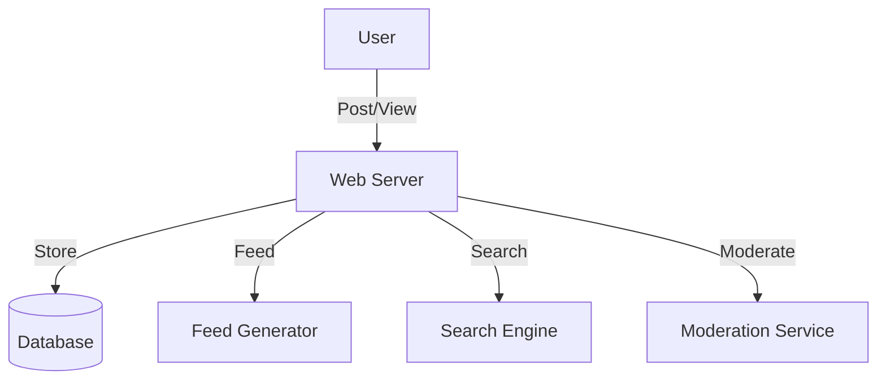

# Forum-like System (Quora, Reddit): Interview Study Guide

## 1. Conceptual Overview
A forum system lets users post questions, answers, links, and comments. Supports voting, tagging, feeds, and moderation.

---

## 2. Requirements & Constraints
- User registration, authentication
- Post questions, answers, links
- Commenting, upvotes/downvotes
- Tagging and search
- Newsfeed generation
- Moderation and reporting
- Scalability and reliability

---

## 3. High-Level Architecture Diagram


---

## 4. Core Components & Data Flow
- **Web Server:** Handles user requests
- **Database:** Stores posts, users, comments, votes
- **Feed Generator:** Builds personalized feeds
- **Search Engine:** Enables search by tags, keywords
- **Moderation Service:** Handles reports, spam

---

## 5. Example Walkthrough
1. User posts a question
2. Web server stores post in DB
3. Feed generator updates followers' feeds
4. Other users comment, vote
5. Moderation service reviews flagged content

---

## 6. Key Algorithms & Data Structures
### Feed Generation (Fanout)
- Push new posts to followers' feeds
- Pull model for large-scale (on-demand feed generation)

### Voting System
```python
# Upvote/downvote logic
votes = {}
def vote(post_id, user_id, value):
    votes[(post_id, user_id)] = value
```

---

## 7. Scaling, Reliability, and Trade-offs
- **Scalability:** Shard by user/post ID, cache hot feeds
- **Reliability:** Replicate DB, async feed updates
- **Moderation:** Automated spam detection, manual review

---

## 8. Common Interview Questions

### How to scale feed generation?
- Use a combination of push (fanout-on-write) and pull (fanout-on-read) models.
- Cache hot feeds for active users.
- Shard feed data by user or region.
- Use message queues for asynchronous feed updates.

### How to store and retrieve posts efficiently?
- Use a relational or NoSQL database with indexes on post IDs, user IDs, and tags.
- Store posts in a denormalized format for fast reads.
- Use pagination and caching for popular posts.

### How to prevent spam and abuse?
- Implement rate limiting and CAPTCHA for suspicious activity.
- Use automated spam detection (machine learning or rule-based).
- Allow users to report content; enable moderation workflows.

### How to implement voting and ranking?
- Store votes in a separate table or data structure keyed by post and user.
- Use algorithms like Reddit’s hot ranking or time-decay scoring.
- Cache vote counts and rankings for performance.

### How to support search and tagging?
- Use a search engine (e.g., Elasticsearch) for full-text and tag-based search.
- Index posts by tags, keywords, and metadata.
- Support autocomplete and filtering by tags.

---

## 9. Real-World Use Cases
- Quora, Reddit, HackerNews, Stack Overflow

---

## 10. Tips for Interviews

- Draw architecture and data flow diagrams
Walk through post/comment flows
- Discuss feed generation, moderation, scaling:
    - **Feed Generation:** Explain how feeds can be generated using push (fanout-on-write) for smaller follower sets and pull (fanout-on-read) for large-scale systems. Mention caching hot feeds and using message queues for async updates.
    - **Moderation:** Describe the need for automated spam detection (using ML or rules), manual review, and user reporting. Highlight the importance of scalable moderation workflows.
    - **Scaling:** Discuss sharding by user/post, caching, and using distributed databases to handle high traffic and large data volumes. Emphasize async processing for feed updates and moderation.

- Mention trade-offs (push vs pull feeds, DB choice):
    - **Push vs Pull Feeds:** Push (fanout-on-write) is fast for users with few followers but can overload the system for users with millions of followers. Pull (fanout-on-read) is more scalable for large follower sets but increases read-time latency. Hybrid approaches are often used.
    - **DB Choice:** Relational DBs offer strong consistency and complex queries, while NoSQL DBs provide scalability and flexible schemas. The choice depends on workload, consistency, and scaling needs.


## 11. Further Reading
- [Reddit System Design](https://www.geeksforgeeks.org/system-design/design-reddit-system-design/)
- [Quora Architecture](https://www.geeksforgeeks.org/system-design/design-quora-system-design/)
- [Fanout Models](https://highscalability.com/fanout/)

---

**Practice, visualize, and explain clearly—this will make you interview ready!**
