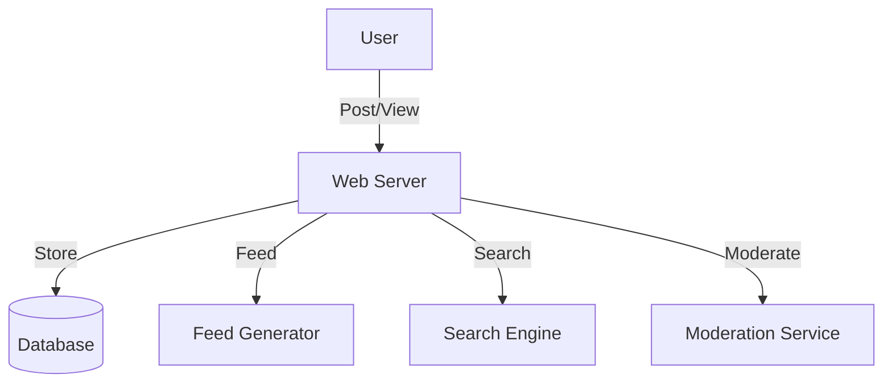

# Forum-like System (Quora, Reddit): Interview Study Guide

## 1. Conceptual Overview
A forum system lets users post questions, answers, links, and comments. Supports voting, tagging, feeds, and moderation.

---

## 2. Requirements & Constraints
- User registration, authentication
- Post questions, answers, links
- Commenting, upvotes/downvotes
- Tagging and search
- Newsfeed generation
- Moderation and reporting
- Scalability and reliability

---

## 3. High-Level Architecture Diagram


---

## 4. Core Components & Data Flow
- **Web Server:** Handles user requests
- **Database:** Stores posts, users, comments, votes
- **Feed Generator:** Builds personalized feeds
- **Search Engine:** Enables search by tags, keywords
- **Moderation Service:** Handles reports, spam

---

## 5. Example Walkthrough
1. User posts a question
2. Web server stores post in DB
3. Feed generator updates followers' feeds
4. Other users comment, vote
5. Moderation service reviews flagged content

---

## 6. Key Algorithms & Data Structures
### Feed Generation (Fanout)
- Push new posts to followers' feeds
- Pull model for large-scale (on-demand feed generation)

### Voting System
```python
# Upvote/downvote logic
votes = {}
def vote(post_id, user_id, value):
    votes[(post_id, user_id)] = value
```

---

## 7. Scaling, Reliability, and Trade-offs
- **Scalability:** Shard by user/post ID, cache hot feeds
- **Reliability:** Replicate DB, async feed updates
- **Moderation:** Automated spam detection, manual review

---

## 8. Common Interview Questions
- How to scale feed generation?
- How to store and retrieve posts efficiently?
- How to prevent spam and abuse?
- How to implement voting and ranking?
- How to support search and tagging?

---

## 9. Real-World Use Cases
- Quora, Reddit, HackerNews, Stack Overflow

---

## 10. Tips for Interviews
- Draw architecture and data flow diagrams
- Discuss feed generation, moderation, scaling
- Mention trade-offs (push vs pull feeds, DB choice)
- Walk through post/comment flows

---

## 11. Further Reading
- [Reddit System Design](https://www.geeksforgeeks.org/system-design/design-reddit-system-design/)
- [Quora Architecture](https://www.geeksforgeeks.org/system-design/design-quora-system-design/)
- [Fanout Models](https://highscalability.com/fanout/)

---

**Practice, visualize, and explain clearly—this will make you interview ready!**
