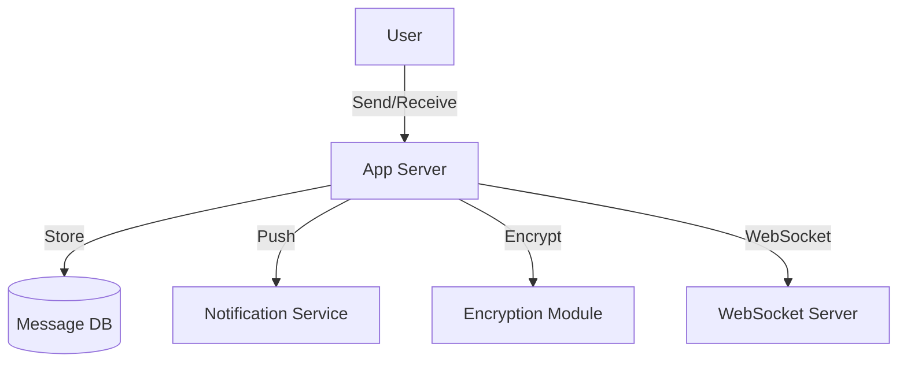

# Facebook Messenger/WhatsApp (Global Chat Service): Interview Study Guide

## 1. Conceptual Overview
A global chat service enables real-time messaging between users, supporting one-on-one and group chats, media sharing, and notifications. Must be scalable, reliable, and secure.

---

## 2. Requirements & Constraints
- Real-time messaging (text, media)
- One-on-one and group chats
- Message delivery and read receipts
- Offline message storage
- End-to-end encryption
- Push notifications
- Scalability and reliability

---

## 3. High-Level Architecture Diagram



---

## 4. Core Components & Data Flow
- **App Server:** Handles user connections, authentication
- **Message DB:** Stores messages, chat history
- **WebSocket Server:** Enables real-time communication
- **Notification Service:** Sends push notifications
- **Encryption Module:** Secures messages

---

## 5. Example Walkthrough
1. User sends message
2. App server authenticates, encrypts, stores message
3. WebSocket delivers to recipient (if online)
4. If offline, notification sent; message delivered on next login

---

## 6. Key Algorithms & Data Structures
### Real-Time Messaging (WebSocket)
- Persistent connection for instant delivery

### End-to-End Encryption (Simplified)
```python
# Pseudocode for encrypt/decrypt
from cryptography.fernet import Fernet
key = Fernet.generate_key()
f = Fernet(key)
enc = f.encrypt(b"Hello")
dec = f.decrypt(enc)
```

---

## 7. Scaling, Reliability, and Trade-offs
- **Scalability:** Partition users, use distributed DB, sharding
- **Reliability:** Replicate messages, retry on failure
- **Security:** Encrypt messages, secure authentication
- **Offline Support:** Store undelivered messages

---

## 8. Common Interview Questions
- How to ensure real-time delivery?
- How to scale for millions of users?
- How to implement end-to-end encryption?
- How to handle offline users?
- How to support group chats?

---

## 9. Real-World Use Cases
- WhatsApp, Facebook Messenger, Telegram, Signal

---

## 10. Tips for Interviews
- Draw architecture and data flow diagrams
- Discuss WebSocket, encryption, offline support
- Mention trade-offs (latency, security, reliability)
- Walk through message delivery flows

---

## 11. Further Reading
- [WhatsApp System Design](https://www.geeksforgeeks.org/system-design/designing-whatsapp-messenger-system-design/)
- [Messenger Architecture](https://www.geeksforgeeks.org/system-design/desiging-facebook-messenger-system-design-interview/)
- [WebSocket Protocol](https://developer.mozilla.org/en-US/docs/Web/API/WebSockets_API)

---

**Practice, visualize, and explain clearly—this will make you interview ready!**
