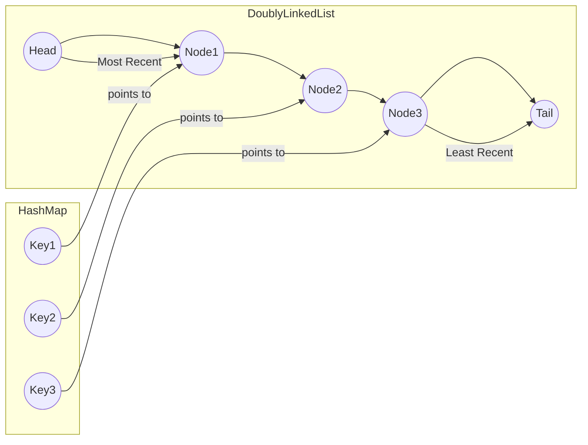

# LRU Cache: Complete Study Guide for Interviews

## 1. What is an LRU Cache?
**LRU (Least Recently Used) Cache** is a data structure that stores a limited number of items and discards the least recently used item when the cache exceeds its capacity. It is widely used in memory management, web browsers, and databases.

---

## 2. Why is LRU Important in Interviews?
- Tests your understanding of data structures (hash maps, linked lists)
- Assesses your ability to design efficient systems (O(1) operations)
- Common in system design and coding interviews

---

## 3. LRU Cache Requirements
- **get(key):** Return value if key exists, else -1. Marks key as recently used.
- **put(key, value):** Insert or update value. If cache is full, evict least recently used item.
- **All operations must be O(1) time complexity.**

---

## 4. LRU Cache Design
### Data Structures Used
- **Hash Map:** Maps keys to nodes for O(1) access.
- **Doubly Linked List:** Maintains usage order (most recent at head, least at tail).

### Diagram


---

## 5. LRU Cache Operations Explained
### get(key)
1. If key not in map, return -1.
2. Move node to head (most recent).
3. Return value.

### put(key, value)
1. If key exists, update value and move node to head.
2. If key does not exist:
    - If cache is at capacity, remove tail node (least recent) and its key from map.
    - Insert new node at head and add to map.

---

## 6. Example Walkthrough
Assume capacity = 2

| Operation | Cache State (Most→Least Recent) | Map |
|-----------|-------------------------------|-----|
| put(1,1)  | 1                             | 1   |
| put(2,2)  | 2,1                           | 1,2 |
| get(1)    | 1,2                           | 1,2 |
| put(3,3)  | 3,1                           | 1,3 |
| get(2)    | -1                            | 1,3 |
| put(4,4)  | 4,3                           | 3,4 |
| get(1)    | -1                            | 3,4 |
| get(3)    | 3,4                           | 3,4 |
| get(4)    | 4,3                           | 3,4 |

---

## 7. Python Implementation
```python
class Node:
    def __init__(self, key, value):
        self.key = key
        self.value = value
        self.prev = self.next = None

class LRUCache:
    def __init__(self, capacity):
        self.capacity = capacity
        self.map = {}
        self.head = Node(0, 0)
        self.tail = Node(0, 0)
        self.head.next = self.tail
        self.tail.prev = self.head

    def _remove(self, node):
        prev, nxt = node.prev, node.next
        prev.next, nxt.prev = nxt, prev

    def _add(self, node):
        node.next = self.head.next
        node.prev = self.head
        self.head.next.prev = node
        self.head.next = node

    def get(self, key):
        if key not in self.map:
            return -1
        node = self.map[key]
        self._remove(node)
        self._add(node)
        return node.value

    def put(self, key, value):
        if key in self.map:
            self._remove(self.map[key])
        node = Node(key, value)
        self._add(node)
        self.map[key] = node
        if len(self.map) > self.capacity:
            lru = self.tail.prev
            self._remove(lru)
            del self.map[lru.key]
```

---

## 8. Common Interview Questions
- **Which design pattern is used in this code?**  
    The LRU Cache implementation uses the **Adapter** and **Composite** design patterns. The Adapter pattern is seen in how the cache combines a hash map and a doubly linked list to provide a unified interface for O(1) operations. The Composite pattern is reflected in the linked list node structure, where each node contains references to other nodes, forming a recursive object structure. Additionally, the overall design follows the **Cache** design pattern, which is a common structural pattern for managing temporary storage of data.
- **How do you ensure O(1) for both get and put?**  
    By combining a hash map and a doubly linked list. The hash map provides O(1) access to nodes by key, and the doubly linked list allows O(1) insertion and removal of nodes to update usage order.

- **Why use a doubly linked list?**  
    A doubly linked list enables efficient removal and insertion of nodes from both ends in O(1) time, which is essential for quickly updating the most and least recently used items.

- **How would you modify for thread safety?**  
    Use synchronization mechanisms such as locks (e.g., `threading.Lock` in Python or `synchronized` blocks in Java) to protect shared data structures. Alternatively, use concurrent data structures or design the cache for single-threaded access if possible.

- **How to adapt for LFU (Least Frequently Used) cache?**  
    Track the frequency of access for each key, often using an additional hash map and a frequency list. When eviction is needed, remove the key with the lowest frequency. This typically requires more complex data structures to maintain O(1) operations.

---

## 9. Tips for Interviews
- Draw diagrams to explain your approach.
- Walk through an example with the interviewer.
- Discuss trade-offs (memory vs. speed).

    When designing an LRU (Least Recently Used) cache, there is a fundamental trade-off between memory usage and speed:

    - **Memory:** Increasing the cache size allows more items to be stored, reducing the number of cache misses. However, this consumes more memory, which may not be available or may impact other parts of the system.
    - **Speed:** A larger cache can improve speed by reducing the need to fetch data from slower storage. However, managing a larger cache (especially with complex eviction policies like LRU) can introduce overhead, potentially slowing down cache operations (insert, lookup, eviction).

    **Summary:**  
    Choosing the right cache size and eviction strategy involves balancing the need for fast access (speed) with the limitations of available memory. Too small a cache leads to frequent misses (slower performance), while too large a cache wastes memory and may slow down cache

- Mention real-world use cases (OS page replacement, web cache).

    **Explanation:**  
    The Least Recently Used (LRU) algorithm is widely used in systems where limited resources (like memory or cache) must be managed efficiently. For example:
    - **Operating System Page Replacement:** When physical memory is full, the OS uses LRU to decide which memory pages to swap out, replacing the page that hasn’t been used for the longest time.
    - **Web Cache:** Web browsers and proxy servers use LRU to remove the least recently accessed web resources from the cache, ensuring that frequently visited pages load faster while less-used data is discarded.

---

## 10. Further Reading
- [LRU Cache - LeetCode](https://leetcode.com/problems/lru-cache/)
- [Design Patterns: Caching](https://refactoring.guru/design-patterns/cache)
- [Wikipedia: Cache Replacement Policies](https://en.wikipedia.org/wiki/Cache_replacement_policies)

---

**Practice, visualize, and explain clearly—this will make you interview ready!**
