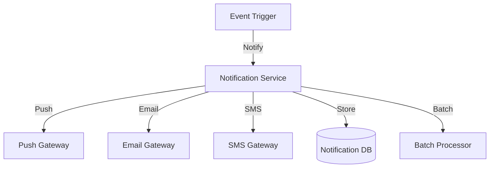

# Notification System (Push Notifications): Interview Study Guide

## 1. Conceptual Overview
A notification system delivers timely alerts to users via push notifications, emails, or SMS. Must be scalable, reliable, and support personalization.

---

## 2. Requirements & Constraints
- Real-time and scheduled notifications
- Multi-channel delivery (push, email, SMS)
- User preferences and opt-in/out
- Scalability and reliability
- Personalization and batching
- Security and privacy

---

## 3. High-Level Architecture Diagram

---

## 4. Core Components & Data Flow
- **Notification Service:** Handles notification logic
- **Push/Email/SMS Gateway:** Delivers notifications
- **Notification DB:** Stores notification history
- **Batch Processor:** Handles bulk notifications

---

## 5. Example Walkthrough
1. Event triggers notification
2. Notification service checks user preferences
3. Delivers via appropriate channel
4. Stores notification in DB

---

## 6. Key Algorithms & Data Structures
### Batching & Personalization
- Group notifications for efficiency
- Personalize content per user

### Rate Limiting
- Prevent notification spam

---

## 7. Scaling, Reliability, and Trade-offs
- **Scalability:** Use distributed gateways, partition by user
- **Reliability:** Retry failed deliveries, monitor health
- **Personalization:** Store user preferences

---

## 8. Common Interview Questions
- How to scale notification delivery?
- How to support multiple channels?
- How to personalize notifications?
- How to handle failures and retries?
- How to prevent notification spam?

---

## 9. Real-World Use Cases
- Mobile apps, email alerts, SMS reminders

---

## 10. Tips for Interviews
- Draw architecture and data flow diagrams
- Discuss batching, personalization, retries
- Mention trade-offs (speed, reliability, privacy)
- Walk through notification flows

---

## 11. Further Reading
- [Notification System Design](https://www.geeksforgeeks.org/system-design/design-notification-services-system-design/)
- [Push Notification Architecture](https://developer.android.com/guide/topics/ui/notifiers/notifications)

---

**Practice, visualize, and explain clearly—this will make you interview ready!**
