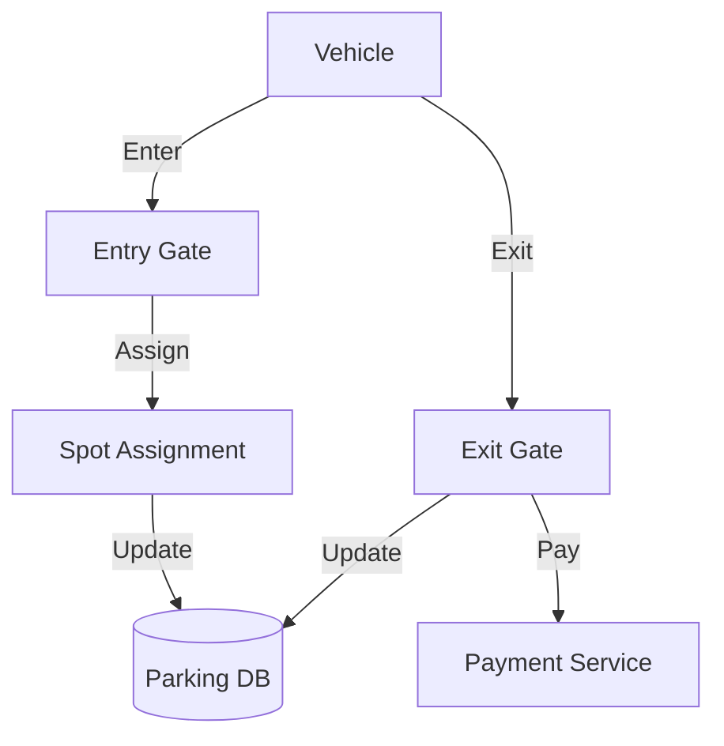

# Parking Lot System: Interview Study Guide

## 1. Conceptual Overview
A parking lot system manages parking spaces, vehicle entry/exit, payments, and spot assignment. Must be efficient, scalable, and easy to use.

---

## 2. Requirements & Constraints
- Multiple levels, rows, and spot types (car, bike, bus)
- Entry/exit management
- Spot assignment and availability tracking
- Payment processing
- Pricing by spot type/time
- Scalability and reliability

---

## 3. High-Level Architecture Diagram



---

## 4. Core Components & Data Flow
- **Entry/Exit Gate:** Manages vehicle flow
- **Spot Assignment:** Allocates available spots
- **Parking DB:** Tracks occupancy, payments
- **Payment Service:** Handles payments

---

## 5. Example Walkthrough
1. Vehicle enters, entry gate records entry
2. Spot assignment allocates spot
3. Parking DB updated
4. Vehicle exits, payment processed
5. Spot marked available

---

## 6. Key Algorithms & Data Structures
### Spot Assignment
- Use priority queue for nearest/available spot

### Pricing Calculation
```python
# Pseudocode for pricing
rates = {'car': 10, 'bike': 5, 'bus': 20}
def calculate_fee(vehicle_type, hours):
    return rates[vehicle_type] * hours
```

---

## 7. Scaling, Reliability, and Trade-offs
- **Scalability:** Partition by level/row, cache availability
- **Reliability:** Replicate DB, monitor health
- **Efficiency:** Fast spot lookup, minimize wait time

---

## 8. Common Interview Questions
- How to assign spots efficiently?
- How to track availability?
- How to handle payments?
- How to scale for large lots?
- How to support multiple vehicle types?

---

## 9. Real-World Use Cases
- Malls, airports, stadiums, smart parking apps

---

## 10. Tips for Interviews
- Draw architecture and data flow diagrams
- Discuss spot assignment, pricing, scaling
- Mention trade-offs (speed, cost, reliability)
- Walk through entry/exit/payment flows

---

## 11. Further Reading
- [Parking Lot System Design](https://www.geeksforgeeks.org/system-design/design-parking-lot-system-design/)
- [Priority Queue](https://en.wikipedia.org/wiki/Priority_queue)

---

**Practice, visualize, and explain clearly—this will make you interview ready!**
