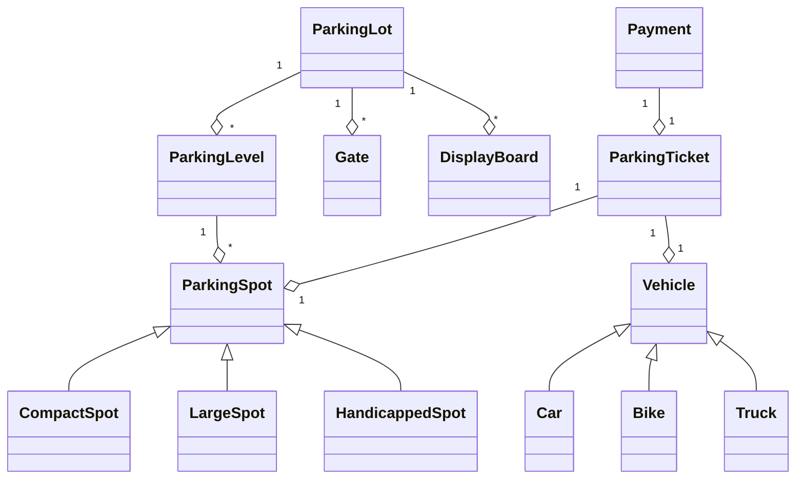
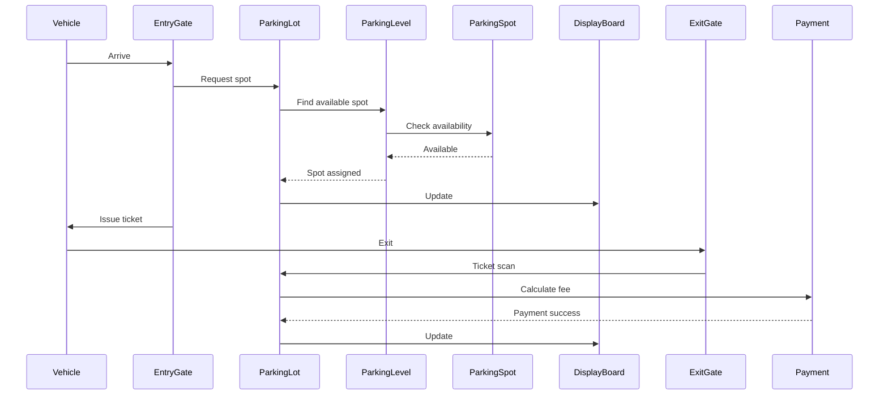

# Parking Lot System: Complete Study Guide for Interviews

## 1. What is a Parking Lot System?
A Parking Lot System is a real-world object-oriented design problem often asked in interviews. It involves designing a system to manage parking spaces, vehicles, tickets, and payments efficiently.

---

## 2. Why is it Important in Interviews?
- Tests OOP concepts (abstraction, inheritance, polymorphism, encapsulation)
- Assesses system design, scalability, and real-world modeling
- Common in LLD/System Design interviews

---

## 3. Core Requirements
- Multiple parking levels/floors
- Different types of parking spots (compact, large, handicapped, etc.)
- Different vehicle types (car, bike, truck, etc.)
- Issue parking tickets and calculate fees
- Track available spots and occupancy
- Support for entry/exit, payment, and admin operations

---

## 4. Key Classes & Relationships
### Main Classes
- **ParkingLot**: Manages all levels and overall operations
- **ParkingLevel**: Represents a floor with multiple spots
- **ParkingSpot**: Represents a single spot (can be subclassed by type)
- **Vehicle**: Base class for vehicles (Car, Bike, Truck, etc.)
- **ParkingTicket**: Issued when a vehicle enters
- **DisplayBoard**: Shows available spots
- **Payment**: Handles payment processing
- **Gate**: Entry/exit points

### Class Diagram


---

## 5. Example Flow: Vehicle Entry & Exit
1. Vehicle arrives at entry gate
2. System checks for available spot (by type)
3. Issues parking ticket and assigns spot
4. Vehicle parks; display board updates
5. On exit, ticket is scanned, fee calculated
6. Payment processed; spot marked available

### Sequence Diagram


---

## 6. Python Implementation (Simplified)
```python
class Vehicle:
    def __init__(self, license_plate):
        self.license_plate = license_plate

class ParkingSpot:
    def __init__(self, spot_id, spot_type):
        self.spot_id = spot_id
        self.spot_type = spot_type
        self.is_free = True
        self.vehicle = None
    def park(self, vehicle):
        if self.is_free:
            self.vehicle = vehicle
            self.is_free = False
            return True
        return False
    def leave(self):
        self.vehicle = None
        self.is_free = True

class ParkingLevel:
    def __init__(self, level_id, spots):
        self.level_id = level_id
        self.spots = spots  # list of ParkingSpot
    def find_free_spot(self, spot_type):
        for spot in self.spots:
            if spot.spot_type == spot_type and spot.is_free:
                return spot
        return None

class ParkingLot:
    def __init__(self, levels):
        self.levels = levels  # list of ParkingLevel
    def park_vehicle(self, vehicle, spot_type):
        for level in self.levels:
            spot = level.find_free_spot(spot_type)
            if spot:
                spot.park(vehicle)
                return spot
        return None
```

---

## 7. Common Interview Questions
- **Which design pattern is used in this code?**  
    The code primarily demonstrates the **Composition** and **Inheritance** principles of object-oriented design, but it also closely follows the **Factory Pattern** in the way parking spots and vehicles can be instantiated based on type. Additionally, the **Strategy Pattern** could be applied for fee calculation or spot assignment logic, though it's not explicitly implemented in the provided code. The design is modular, making it easy to extend with these patterns as requirements grow.
- **How do you handle full capacity?**  
    The system should check for available spots before issuing a ticket. If all spots are full, entry gates can display a "Full" message and prevent new vehicles from entering. Optionally, a waitlist or notification system can be implemented.

- **How to extend for electric vehicle charging?**  
    Add a new spot type (e.g., `ElectricSpot`) and track charging station availability. Vehicles can specify if they need charging, and the system assigns an appropriate spot. Charging status and billing can be integrated into the payment module.

- **How to support reservations or dynamic pricing?**  
    Implement a reservation module to allow users to book spots in advance. For dynamic pricing, integrate a pricing engine that adjusts fees based on demand, time, or spot type. Store reservation and pricing data in the system for real-time updates.

- **How to make the system thread-safe?**  
    Use synchronization mechanisms (like locks or semaphores) to prevent race conditions when updating shared resources (e.g., spot availability). In distributed systems, consider using atomic transactions or distributed locks.

- **How to scale for thousands of vehicles?**  
    Use efficient data structures (like hash maps for quick lookups), partition data by levels or zones, and consider microservices for different modules (entry, payment, reservations). Employ caching and load balancing to handle high traffic and ensure high availability.

---

## 8. Tips for Interviews
- Draw diagrams to explain your design
- Use real-world analogies
- Discuss trade-offs (simplicity vs. extensibility)
    - Simplicity means designing the system to be as straightforward and easy to understand as possible. This often leads to faster development and easier maintenance, but may limit the ability to add new features in the future.
    - Extensibility focuses on designing the system so it can easily accommodate future changes or new requirements. This can make the initial design more complex and require more effort up front, but it pays off when the system needs to evolve.
    - The trade-off is that prioritizing simplicity can make future changes harder, while prioritizing extensibility can make the initial system harder to build and understand. The best approach depends on project goals, expected future changes, and
- Mention edge cases (lost ticket, spot type mismatch)
    - Lost ticket: If a customer loses their parking ticket, the system should have a process to verify ownership of the vehicle and calculate the fee, possibly charging a penalty or maximum daily rate.
    - Spot type mismatch: If a vehicle is parked in a spot not designed for its type (e.g., a truck in a compact spot), the system should detect this and either prevent the assignment or flag

---

## 9. Further Reading
- [System Design Primer](https://github.com/donnemartin/system-design-primer)
- [OOD Patterns](https://refactoring.guru/design-patterns)

---

**Practice, visualize, and explain clearly—this will make you interview ready!**
