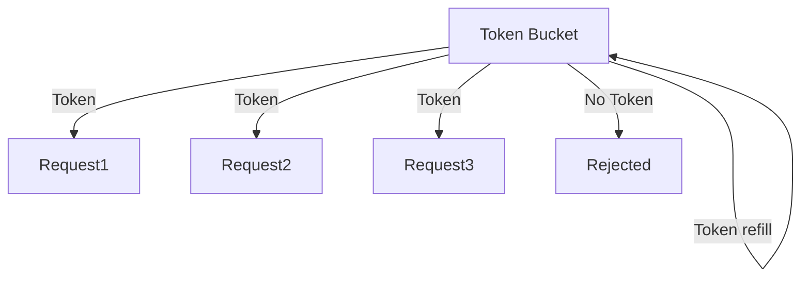
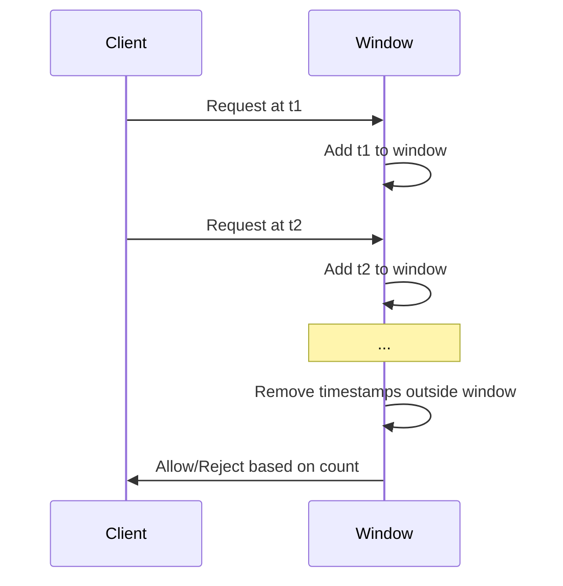
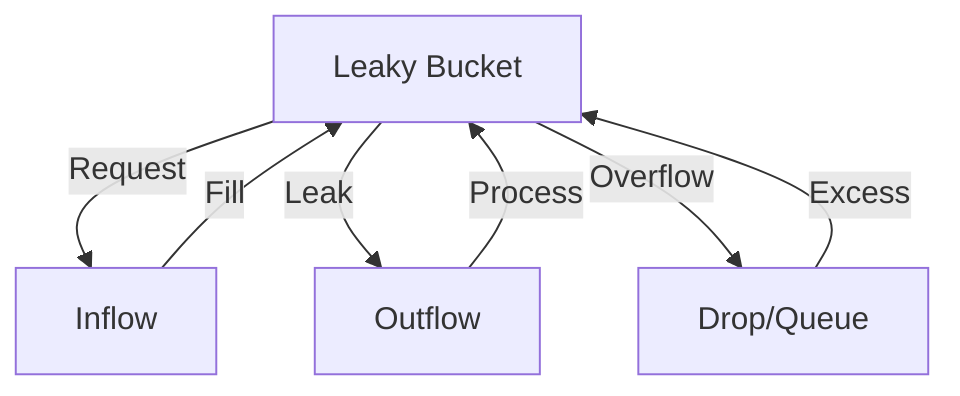

# Rate Limiter System: Complete Study Guide for Interviews

## 1. What is a Rate Limiter?
A rate limiter restricts how many requests a user or system can make in a given time window. It protects resources, prevents abuse, and ensures fair usage in APIs, web services, and distributed systems.

---

## 2. Why is Rate Limiting Important in Interviews?
- Tests your understanding of concurrency, distributed systems, and time-based algorithms
- Assesses ability to design scalable, robust systems
- Common in backend, API, and system design interviews

---

## 3. Core Requirements
- Limit requests per user/IP/key in a time window (e.g., 100 requests/minute)
- Fast response (O(1) or O(log n) per request)
- Support for multiple algorithms (fixed window, sliding window, token bucket, leaky bucket)
- Thread-safe and scalable
- Configurable limits

---

## 4. Key Algorithms
### Fixed Window
- Count requests in a fixed interval (e.g., per minute)
- Simple, but can allow bursts at window edges

### Sliding Window
- Count requests in a moving time window
- Smoother limiting, more accurate

### Token Bucket
- Tokens are added at a fixed rate; each request consumes a token
- Allows bursts up to bucket size

### Leaky Bucket
- Requests are processed at a fixed rate; excess requests are queued or dropped

---


## 5. Diagrams: Rate Limiting Algorithms

### Token Bucket Algorithm


### Sliding Window Algorithm


### Leaky Bucket Algorithm


---

## 6. Example Walkthrough (Token Bucket)
- Bucket size = 5, refill rate = 1 token/sec
- At t=0, bucket has 5 tokens
- 3 requests arrive: all accepted (tokens used)
- 3 more requests: 2 accepted, 1 rejected (no token)
- After 2 seconds, 2 tokens refilled

---


## 7. Python Implementations

### Token Bucket
```python
import time
class TokenBucket:
    def __init__(self, capacity, refill_rate):
        self.capacity = capacity
        self.tokens = capacity
        self.refill_rate = refill_rate
        self.last_refill = time.time()
    def allow_request(self):
        now = time.time()
        elapsed = now - self.last_refill
        refill = int(elapsed * self.refill_rate)
        if refill > 0:
            self.tokens = min(self.capacity, self.tokens + refill)
            self.last_refill = now
        if self.tokens > 0:
            self.tokens -= 1
            return True
        return False
```

### Sliding Window
```python
import time
from collections import deque
class SlidingWindowRateLimiter:
    def __init__(self, max_requests, window_size):
        self.max_requests = max_requests
        self.window_size = window_size  # seconds
        self.timestamps = deque()
    def allow_request(self):
        now = time.time()
        while self.timestamps and now - self.timestamps[0] > self.window_size:
            self.timestamps.popleft()
        if len(self.timestamps) < self.max_requests:
            self.timestamps.append(now)
            return True
        return False
```

### Leaky Bucket
```python
import time
class LeakyBucket:
    def __init__(self, capacity, leak_rate):
        self.capacity = capacity
        self.leak_rate = leak_rate  # requests per second
        self.water = 0
        self.last_check = time.time()
    def allow_request(self):
        now = time.time()
        leaked = (now - self.last_check) * self.leak_rate
        self.water = max(0, self.water - leaked)
        self.last_check = now
        if self.water < self.capacity:
            self.water += 1
            return True
        return False
```

---

## 8. Scaling for Production
- **Per-user/IP buckets:** Use a map to track buckets per key
- **Distributed systems:** Use Redis or Memcached for shared state
- **Thread safety:** Use locks or atomic operations
- **Configurable limits:** Allow dynamic changes to rate limits
- **Monitoring:** Log and alert on rate limit violations

---

## 9. Common Interview Questions
### How do you handle distributed rate limiting?

### How to prevent race conditions?
### Answers

**How do you handle distributed rate limiting?**
- Use a centralized cache (Redis, Memcached) to store counters and state across all servers.
- Apply atomic operations (e.g., Redis INCR, Lua scripts) to update counters safely and avoid inconsistencies.
- Consider sharding or partitioning keys to scale horizontally.
- Monitor for replication lag and design for eventual consistency if using distributed caches.

**How to prevent race conditions?**
- Use atomic operations provided by the data store (e.g., Redis transactions, Lua scripts).
- Apply distributed locks if multiple processes may update the same key.
- Design algorithms to be idempotent and resilient to retries.
- Test for concurrency issues and use thread-safe data structures in code.
- In distributed setups, rely on atomic operations provided by your data store.
- Minimize critical sections to reduce contention.

### How to support burst traffic?
- Use algorithms like Token Bucket, which allow short bursts up to the bucket size.
- Configure burst capacity separately from steady-state rate.
- Monitor and adjust limits based on observed traffic patterns.

### How to choose between algorithms?
- **Fixed Window:** Simple, but may allow bursts at window edges.
- **Sliding Window:** More accurate, smoother limiting.
- **Token Bucket:** Supports bursts, flexible refill rate.
- **Leaky Bucket:** Enforces steady outflow, queues excess requests.
- Choose based on accuracy, performance, and traffic patterns.

### How to persist state for recovery?
- Store rate limit counters and bucket states in persistent storage (e.g., Redis, database).
- Periodically snapshot state for backup.
- On restart, reload state to avoid losing track of limits.
- Consider trade-offs between performance and durability.

---

## 10. Tips for Interviews
- Draw diagrams to explain your approach
- Walk through an example with the interviewer
- Discuss trade-offs (accuracy vs. performance)
  - Rate limiting algorithms often balance accuracy (precisely enforcing limits) against performance (minimizing resource usage). For example, a leaky bucket algorithm provides strict control but may require more memory and processing, while a fixed window counter is faster but can allow brief bursts above the limit. Choosing the right approach depends on your application's tolerance for occasional spikes versus the need for strict enforcement.
- Mention real-world use cases (API gateways, login throttling)
  - Rate limiting is widely used in API gateways to prevent abuse and ensure fair usage among clients. It also protects authentication endpoints by throttling login attempts, reducing the risk of brute-force attacks. Other examples include limiting requests to payment systems, controlling traffic to microservices, and managing resource usage in cloud platforms.

---

## 11. Further Reading
- [Rate Limiting Algorithms](https://cloud.google.com/architecture/rate-limiting-apis)
- [Token Bucket Algorithm](https://en.wikipedia.org/wiki/Token_bucket)
- [System Design Primer](https://github.com/donnemartin/system-design-primer)

---

**Practice, visualize, and explain clearly—this will make you interview ready!**
