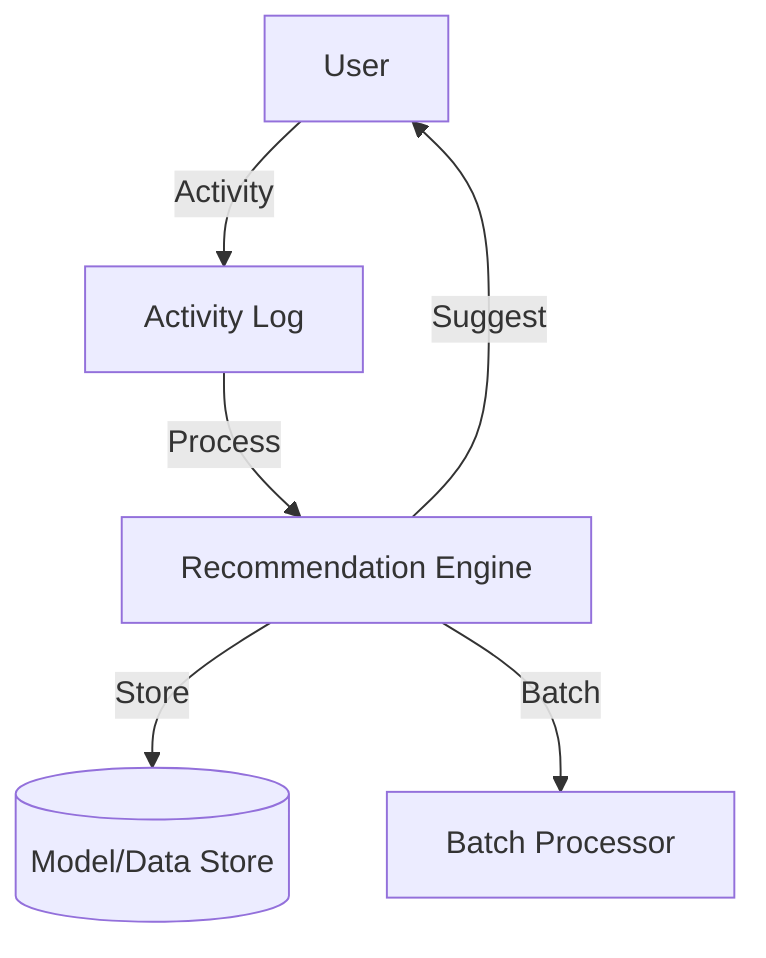

# Recommendation System (Amazon, Netflix): Interview Study Guide

## 1. Conceptual Overview
A recommendation system suggests items (products, movies, etc.) to users based on their preferences and behavior. Must be accurate, scalable, and fast.

---

## 2. Requirements & Constraints
- Personalized recommendations
- Real-time and batch processing
- Scalability for millions of users/items
- Support for cold start (new users/items)
- Diversity and freshness
- Explainability

---

## 3. High-Level Architecture Diagram



---

## 4. Core Components & Data Flow
- **Activity Log:** Tracks user actions
- **Recommendation Engine:** Computes suggestions
- **Model/Data Store:** Stores models, item/user data
- **Batch Processor:** Updates models periodically

---

## 5. Example Walkthrough
1. User browses items
2. Activity logged
3. Recommendation engine updates suggestions
4. Suggestions shown to user

---

## 6. Key Algorithms & Data Structures
### Collaborative Filtering
```python
# Simplified collaborative filtering
user_item_matrix = {...}
def recommend(user_id):
    # Find similar users, suggest their liked items
    pass
```

### Content-Based Filtering
- Recommend items similar to those user liked

---

## 7. Scaling, Reliability, and Trade-offs
- **Scalability:** Use distributed processing, partition by user/item
- **Accuracy:** Combine multiple algorithms
- **Cold Start:** Use popularity, content-based for new users/items

---

## 8. Common Interview Questions
- How to handle cold start?
- How to scale for millions of users/items?
- How to combine multiple recommendation algorithms?
- How to ensure diversity and freshness?
- How to explain recommendations?

---

## 9. Real-World Use Cases
- Amazon, Netflix, Spotify, YouTube

---

## 10. Tips for Interviews
- Draw architecture and data flow diagrams
- Discuss collaborative/content-based filtering
- Mention trade-offs (accuracy, scalability, explainability)
- Walk through recommendation flows

---

## 11. Further Reading
- [Recommendation System Design](https://www.geeksforgeeks.org/system-design/how-to-design-a-recommendation-system/)
- [Collaborative Filtering](https://en.wikipedia.org/wiki/Collaborative_filtering)
- [Netflix Recommendation](https://netflixtechblog.com/)

---

**Practice, visualize, and explain clearly—this will make you interview ready!**
