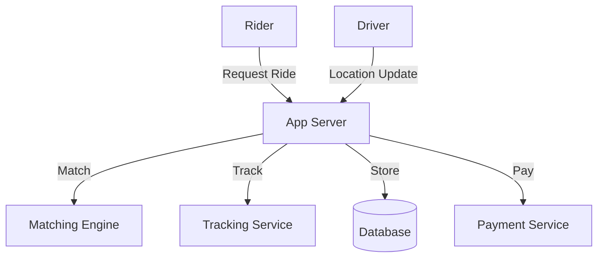

# Uber/Lyft (Ride-Sharing Service): Interview Study Guide

## 1. Conceptual Overview
A ride-sharing service matches riders with drivers, tracks rides, and handles payments. Must be real-time, scalable, and reliable.

---

## 2. Requirements & Constraints
- User registration, authentication
- Real-time ride requests and matching
- Driver location tracking
- ETA calculation
- Payment processing
- Ratings and reviews
- Scalability and reliability

---

## 3. High-Level Architecture Diagram

---

## 4. Core Components & Data Flow
- **App Server:** Handles user and driver requests
- **Matching Engine:** Matches riders to drivers
- **Tracking Service:** Tracks driver/rider locations
- **Database:** Stores rides, users, locations
- **Payment Service:** Handles payments

---

## 5. Example Walkthrough
1. Rider requests ride
2. App server receives request
3. Matching engine finds nearby driver
4. Tracking service updates locations
5. Payment processed after ride

---

## 6. Key Algorithms & Data Structures
### Geospatial Matching
- Use spatial index (e.g., QuadTree, Geohash)
- Find nearest drivers

### ETA Calculation
- Use shortest path algorithms (Dijkstra, A*)

---

## 7. Scaling, Reliability, and Trade-offs
- **Scalability:** Partition by region/city, use distributed DB
- **Reliability:** Replicate data, monitor health
- **Real-Time:** Use push notifications, WebSockets

---

## 8. Common Interview Questions
- How to match riders and drivers efficiently?
- How to track locations in real-time?
- How to scale for millions of users?
- How to calculate ETA?
- How to handle payments securely?

---

## 9. Real-World Use Cases
- Uber, Lyft, Ola, Didi

---

## 10. Tips for Interviews
- Draw architecture and data flow diagrams
- Discuss matching, tracking, scaling
- Mention trade-offs (accuracy, latency, cost)
- Walk through ride request and matching flows

---

## 11. Further Reading
- [Uber System Design](https://www.geeksforgeeks.org/system-design/system-design-of-uber-app-uber-system-architecture/)
- [Geohash Algorithm](https://en.wikipedia.org/wiki/Geohash)
- [Ride Matching](https://www.geeksforgeeks.org/system-design/design-uber-system-design/)

---

**Practice, visualize, and explain clearly—this will make you interview ready!**
