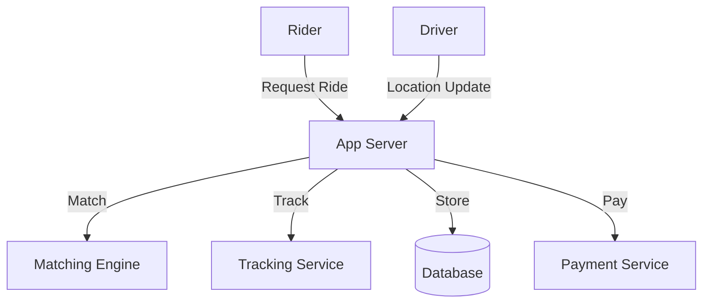

# Uber/Lyft (Ride-Sharing Service): Interview Study Guide

## 1. Conceptual Overview
A ride-sharing service matches riders with drivers, tracks rides, and handles payments. Must be real-time, scalable, and reliable.

---

## 2. Requirements & Constraints
- User registration, authentication
- Real-time ride requests and matching
- Driver location tracking
- ETA calculation
- Payment processing
- Ratings and reviews
- Scalability and reliability

---

## 3. High-Level Architecture Diagram

---

## 4. Core Components & Data Flow
- **App Server:** Handles user and driver requests
- **Matching Engine:** Matches riders to drivers
- **Tracking Service:** Tracks driver/rider locations
- **Database:** Stores rides, users, locations
- **Payment Service:** Handles payments

---

## 5. Example Walkthrough
1. Rider requests ride
2. App server receives request
3. Matching engine finds nearby driver
4. Tracking service updates locations
5. Payment processed after ride

---

## 6. Key Algorithms & Data Structures
### Geospatial Matching
- Use spatial index (e.g., QuadTree, Geohash)
- Find nearest drivers

### ETA Calculation
- Use shortest path algorithms (Dijkstra, A*)

---

## 7. Scaling, Reliability, and Trade-offs
- **Scalability:** Partition by region/city, use distributed DB
- **Reliability:** Replicate data, monitor health
- **Real-Time:** Use push notifications, WebSockets

---

## 8. Common Interview Questions
### How to match riders and drivers efficiently?
- Use geospatial indexing (e.g., Geohash, QuadTree) to quickly find nearby drivers.
- Implement efficient search algorithms to minimize latency.
- Consider driver availability, proximity, and estimated time to pickup.

### How to track locations in real-time?
- Use GPS data from mobile devices.
- Push frequent location updates from drivers and riders to the backend.
- Use WebSockets or push notifications for low-latency updates.

### How to scale for millions of users?
- Partition data and services by region or city.
- Use distributed databases and caching.
- Employ load balancers and auto-scaling infrastructure.

### How to calculate ETA?
- Use shortest path algorithms (like Dijkstra or A*) on real-time map data.
- Factor in current traffic conditions and historical data.

### How to handle payments securely?
- Integrate with secure payment gateways (e.g., Stripe, PayPal).
- Encrypt sensitive data in transit and at rest.
- Follow PCI DSS compliance and best practices for fraud detection.

---

## 9. Real-World Use Cases
- Uber, Lyft, Ola, Didi

---

## 10. Tips for Interviews
- Draw architecture and data flow diagrams  
    Visual diagrams help interviewers quickly understand your system. Use tools like Mermaid or whiteboard sketches to illustrate how components interact (e.g., how ride requests flow from rider to driver, how data moves between services).

- Discuss matching, tracking, scaling  
    Explain the algorithms and data structures used for matching riders and drivers (e.g., geospatial indexing), how real-time tracking is achieved (e.g., GPS, WebSockets), and how the system scales to handle millions of users (e.g., partitioning, distributed databases).

- Mention trade-offs (accuracy, latency, cost)  
    Be ready to discuss trade-offs in your design. For example, more accurate matching may increase latency or cost; real-time tracking may require more resources. Explain how you balance these factors based on system requirements.
- Walk through ride request and matching flows

---

## 11. Further Reading
- [Geohash Algorithm](https://en.wikipedia.org/wiki/Geohash)
- [Ride Matching](https://www.geeksforgeeks.org/system-design/design-uber-system-design/)

---

**Practice, visualize, and explain clearly—this will make you interview ready!**
