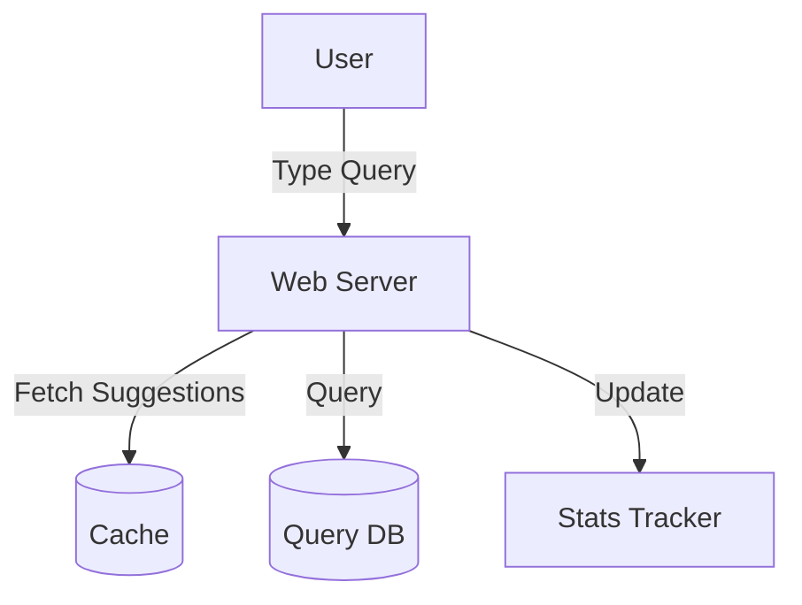

# Search Typeahead/Autocomplete: Interview Study Guide

## 1. Conceptual Overview
Typeahead/autocomplete suggests search queries as users type, improving speed and user experience. Must be fast, relevant, and scalable.

---

## 2. Requirements & Constraints
- Suggest top queries as user types
- Real-time response (low latency)
- Update suggestions based on popularity
- Handle millions of queries
- Support personalization

---

## 3. High-Level Architecture Diagram



---

## 4. Core Components & Data Flow
- **Web Server:** Handles user input
- **Cache:** Stores hot suggestions for fast access
- **Query DB:** Stores historical queries, popularity
- **Stats Tracker:** Updates query stats

---

## 5. Example Walkthrough
1. User types "pyth"
2. Web server fetches suggestions from cache
3. If not found, queries DB
4. Suggestions returned: "python", "python tutorial", etc.
5. User selects suggestion; stats updated

---

## 6. Key Algorithms & Data Structures
### Trie for Fast Lookup
```python
class TrieNode:
    def __init__(self):
        self.children = {}
        self.is_end = False
        self.suggestions = []
```
- Store queries in trie, attach top suggestions at each node

### Ranking Suggestions
- Use frequency/popularity
- Personalize based on user history

---

## 7. Scaling, Reliability, and Trade-offs
- **Scalability:** Partition trie, use distributed cache
- **Reliability:** Replicate data, async updates
- **Latency:** Precompute popular suggestions

---

## 8. Common Interview Questions
- **How to store and update suggestions efficiently?**  
    Use a trie data structure to store queries for fast prefix lookup. Attach a min-heap or sorted list at each node to keep top suggestions. Update suggestions asynchronously based on query frequency and recent trends.

- **How to personalize suggestions?**  
    Maintain user-specific history and preferences. Blend global popular queries with personalized suggestions using ranking algorithms. Store user profiles and recent searches to adjust suggestions in real time.

- **How to scale for millions of users?**  
    Partition the trie and cache across multiple servers (sharding). Use distributed caching systems (like Redis or Memcached) for hot queries. Replicate data for high availability and use load balancers to distribute traffic.

- **How to handle new/rare queries?**  
    Fall back to substring or fuzzy matching when prefix matches are not found. Use machine learning models to predict relevant suggestions for unseen queries. Log rare queries for future analysis and possible inclusion in the suggestion set.

---

## 9. Real-World Use Cases
- Google Search, YouTube, Amazon, e-commerce sites

---

## 10. Tips for Interviews
- Draw architecture and data flow diagrams
- **Discuss trie, cache, ranking:**  
    Be ready to explain how a trie enables fast prefix-based lookups for suggestions, how a cache (like Redis) reduces latency by storing hot queries, and how ranking algorithms (using frequency, recency, or personalization) determine which suggestions to show first.

- **Mention trade-offs (memory vs speed):**  
    Highlight that storing all queries and suggestions in memory (trie, cache) increases speed but uses more memory. Discuss strategies like limiting trie depth, pruning low-frequency queries, or using approximate data structures to balance memory usage and performance.
- Walk through query suggestion flows

---

## 11. Further Reading
- [Autocomplete System Design](https://www.geeksforgeeks.org/system-design/googles-search-autocomplete-high-level-designhld/)
- [Trie Data Structure](https://en.wikipedia.org/wiki/Trie)

---

**Practice, visualize, and explain clearly—this will make you interview ready!**
