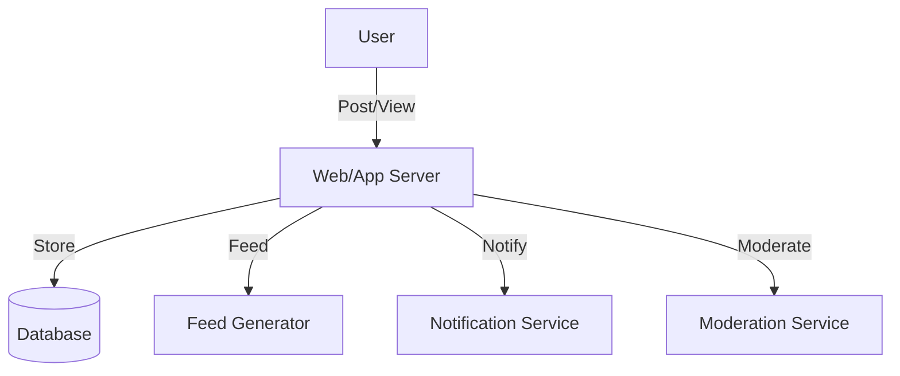

# Facebook/Twitter/Instagram (Social Media Feed, Newsfeed): Interview Study Guide

## 1. Conceptual Overview
A social media feed/newsfeed displays posts from users, friends, or followed accounts. Must be real-time, personalized, and scalable.

---

## 2. Requirements & Constraints
- User registration, authentication
- Post creation (text, images, videos)
- Personalized feed generation
- Likes, comments, shares
- Real-time updates
- Scalability and reliability
- Moderation and privacy controls

---

## 3. High-Level Architecture Diagram

---

## 4. Core Components & Data Flow
- **Web/App Server:** Handles user requests
- **Database:** Stores posts, users, comments, likes
- **Feed Generator:** Builds personalized feeds
- **Notification Service:** Sends updates
- **Moderation Service:** Handles reports, privacy

---

## 5. Example Walkthrough
1. User posts content
2. Web server stores post in DB
3. Feed generator updates followers' feeds
4. Notification service alerts followers
5. Moderation service reviews flagged content

---

## 6. Key Algorithms & Data Structures
### Feed Generation (Fanout)
- Push model: update feeds on post
- Pull model: generate feeds on demand

### Ranking Algorithm
- Use recency, popularity, personalization

---

## 7. Scaling, Reliability, and Trade-offs
- **Scalability:** Shard by user/post ID, cache hot feeds
- **Reliability:** Replicate DB, async feed updates
- **Privacy:** Enforce access controls

---

## 8. Common Interview Questions
- **How to scale feed generation?**  
    Use sharding (by user or post), caching (for hot feeds), and asynchronous processing (e.g., message queues) to distribute load. Consider push vs pull models for feed updates.

- **How to store and retrieve posts efficiently?**  
    Use a combination of databases: NoSQL for fast writes and flexible schema, and in-memory caches (like Redis) for quick retrieval. Index posts by user and timestamp.

- **How to personalize feeds?**  
    Apply ranking algorithms using factors like recency, user interests, engagement, and collaborative filtering. Store user preferences and activity history for better recommendations.

- **How to handle real-time updates?**  
    Implement WebSockets or long polling for instant updates. Use pub/sub systems to notify clients of new posts or interactions.

- **How to moderate content?**  
    Combine automated filters (e.g., ML models for detecting spam or abuse) with manual review workflows. Provide reporting tools and enforce privacy controls.

---

## 9. Real-World Use Cases
- Facebook, Twitter, Instagram, LinkedIn

---

## 10. Tips for Interviews
- **Draw architecture and data flow diagrams:**  
    Use diagrams (like Mermaid or whiteboard sketches) to visually represent system components (web/app servers, databases, feed generators, etc.) and how data moves between them. This helps interviewers quickly grasp your understanding of the system's structure and interactions.

- **Discuss feed generation, ranking, scaling:**  
    Explain how feeds are generated (push vs pull models), how posts are ranked (recency, engagement, personalization), and strategies for scaling (sharding, caching, asynchronous processing). Highlight how each approach impacts performance and user experience.

- **Mention trade-offs (push vs pull, DB choice):**  
    Compare push (precompute feeds) and pull (generate on demand) models, noting their pros and cons in terms of latency, storage, and complexity. Discuss database choices (SQL vs NoSQL, caching layers) and how they affect scalability, consistency, and development speed.

- **Walk through post/feed flows:**  
    Clearly describe the end-to-end flow: when a user creates a post, how it is stored, how followers' feeds are updated, and how notifications are sent. Use step-by-step examples to demonstrate your understanding of the system's operation.

---

## 11. Further Reading
- [Twitter Feed System Design](https://www.geeksforgeeks.org/interview-experiences/design-twitter-a-system-design-interview-question/)
- [Instagram Architecture](https://www.geeksforgeeks.org/system-design/design-instagram-a-system-design-interview-question/)
- [Fanout Models](https://highscalability.com/fanout/)

---

**Practice, visualize, and explain clearly—this will make you interview ready!**
