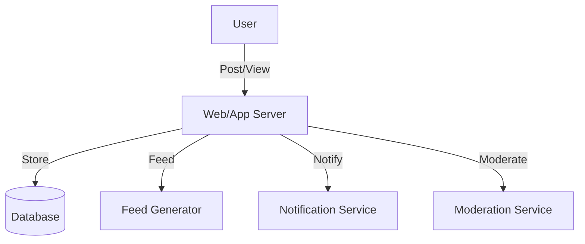

# Facebook/Twitter/Instagram (Social Media Feed, Newsfeed): Interview Study Guide

## 1. Conceptual Overview
A social media feed/newsfeed displays posts from users, friends, or followed accounts. Must be real-time, personalized, and scalable.

---

## 2. Requirements & Constraints
- User registration, authentication
- Post creation (text, images, videos)
- Personalized feed generation
- Likes, comments, shares
- Real-time updates
- Scalability and reliability
- Moderation and privacy controls

---

## 3. High-Level Architecture Diagram

---

## 4. Core Components & Data Flow
- **Web/App Server:** Handles user requests
- **Database:** Stores posts, users, comments, likes
- **Feed Generator:** Builds personalized feeds
- **Notification Service:** Sends updates
- **Moderation Service:** Handles reports, privacy

---

## 5. Example Walkthrough
1. User posts content
2. Web server stores post in DB
3. Feed generator updates followers' feeds
4. Notification service alerts followers
5. Moderation service reviews flagged content

---

## 6. Key Algorithms & Data Structures
### Feed Generation (Fanout)
- Push model: update feeds on post
- Pull model: generate feeds on demand

### Ranking Algorithm
- Use recency, popularity, personalization

---

## 7. Scaling, Reliability, and Trade-offs
- **Scalability:** Shard by user/post ID, cache hot feeds
- **Reliability:** Replicate DB, async feed updates
- **Privacy:** Enforce access controls

---

## 8. Common Interview Questions
- How to scale feed generation?
- How to store and retrieve posts efficiently?
- How to personalize feeds?
- How to handle real-time updates?
- How to moderate content?

---

## 9. Real-World Use Cases
- Facebook, Twitter, Instagram, LinkedIn

---

## 10. Tips for Interviews
- Draw architecture and data flow diagrams
- Discuss feed generation, ranking, scaling
- Mention trade-offs (push vs pull, DB choice)
- Walk through post/feed flows

---

## 11. Further Reading
- [Twitter Feed System Design](https://www.geeksforgeeks.org/interview-experiences/design-twitter-a-system-design-interview-question/)
- [Instagram Architecture](https://www.geeksforgeeks.org/system-design/design-instagram-a-system-design-interview-question/)
- [Fanout Models](https://highscalability.com/fanout/)

---

**Practice, visualize, and explain clearly—this will make you interview ready!**
