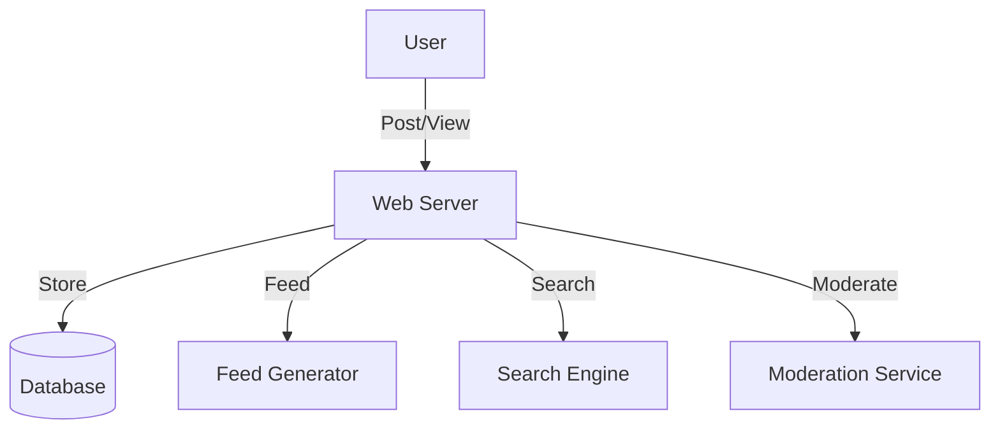

# Quora/Reddit/HackerNews (Social Network/Message Board): Interview Study Guide

## 1. Conceptual Overview
A social network/message board lets users post questions, answers, links, and comments. Supports voting, tagging, feeds, and moderation.

---

## 2. Requirements & Constraints
- User registration, authentication
- Post questions, answers, links
- Commenting, upvotes/downvotes
- Tagging and search
- Newsfeed generation
- Moderation and reporting
- Scalability and reliability

---

## 3. High-Level Architecture Diagram



---

## 4. Core Components & Data Flow
- **Web Server:** Handles user requests
- **Database:** Stores posts, users, comments, votes
- **Feed Generator:** Builds personalized feeds
- **Search Engine:** Enables search by tags, keywords
- **Moderation Service:** Handles reports, spam

---

## 5. Example Walkthrough
1. User posts a question
2. Web server stores post in DB
3. Feed generator updates followers' feeds
4. Other users comment, vote
5. Moderation service reviews flagged content

---

## 6. Key Algorithms & Data Structures
### Feed Generation (Fanout)
- Push new posts to followers' feeds
- Pull model for large-scale (on-demand feed generation)

### Voting System
```python
# Upvote/downvote logic
votes = {}
def vote(post_id, user_id, value):
    votes[(post_id, user_id)] = value
```

---

## 7. Scaling, Reliability, and Trade-offs
- **Scalability:** Shard by user/post ID, cache hot feeds
- **Reliability:** Replicate DB, async feed updates
- **Moderation:** Automated spam detection, manual review

---

## 8. Common Interview Questions

### How to scale feed generation?
- Use a **push model** for users with few followers (push new posts to their feeds).
- Use a **pull model** for users with many followers (generate feeds on demand).
- Employ caching for hot feeds and shard feed data by user ID.

### How to store and retrieve posts efficiently?
- Store posts in a **relational or NoSQL database** with proper indexing (by post ID, user ID, tags).
- Use **denormalization** for fast reads (e.g., store recent posts per user).
- Implement **pagination** and **caching** for popular posts.

### How to prevent spam and abuse?
- Use **automated filters** (e.g., keyword matching, ML models) to detect spam.
- Allow users to **report** abusive content.
- Employ **rate limiting** and **CAPTCHAs** to prevent automated abuse.
- Manual moderation for edge cases.

### How to implement voting and ranking?
- Store votes in a **separate table** or as part of the post document.
- Use **atomic operations** to update vote counts.
- Rank posts using algorithms like **hotness**, **trending**, or **time-decay** scoring.

### How to support search and tagging?
- Use a **search engine** (e.g., Elasticsearch) to index posts by keywords and tags.
- Store tags as a separate field or table for efficient filtering.
- Support **full-text search** and **faceted search** for better user experience.

---

## 9. Real-World Use Cases
- Quora, Reddit, HackerNews, Stack Overflow

---

## 10. Tips for Interviews
- Draw architecture and data flow diagrams
- Discuss feed generation, moderation, scaling:
    - **Feed Generation:** Explain both push and pull models. Push model delivers new posts to followers' feeds in real-time, suitable for users with fewer followers. Pull model generates feeds on demand, which is more scalable for users with many followers.
    - **Moderation:** Describe automated moderation (spam filters, ML models) and manual review for flagged content. Highlight the importance of balancing user experience with platform safety.
    - **Scaling:** Cover sharding databases by user or post ID, caching hot feeds, and replicating services for high availability.

- Mention trade-offs (push vs pull feeds, DB choice):
    - **Push vs Pull Feeds:** Push is efficient for users with few followers but doesn't scale well for celebrities. Pull is more resource-intensive per request but scales better for high-fanout users.
    - **Database Choice:** Relational DBs offer strong consistency and structured queries, while NoSQL DBs provide better scalability and flexibility for unstructured data. The choice depends on workload, consistency, and scaling needs.
- Walk through post/comment flows

---

## 11. Further Reading
- [Reddit System Design](https://www.geeksforgeeks.org/system-design/design-reddit-system-design/)
- [Quora Architecture](https://www.geeksforgeeks.org/system-design/design-quora-system-design/)
- [Fanout Models](https://highscalability.com/fanout/)

---

**Practice, visualize, and explain clearly—this will make you interview ready!**
