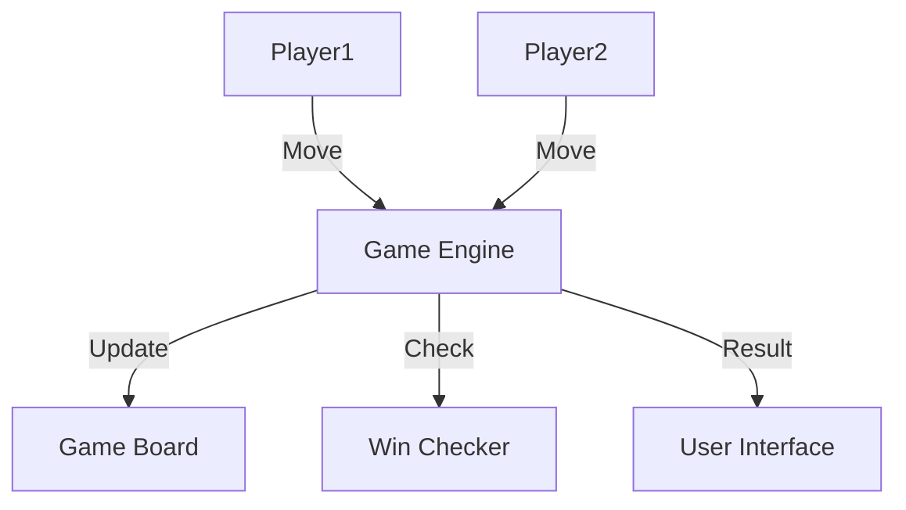

# Tic-Tac-Toe Game: Interview Study Guide

## 1. Conceptual Overview
Tic-Tac-Toe is a two-player game played on a 3x3 grid. Players take turns marking cells; the first to align three marks wins.

---

## 2. Requirements & Constraints
- 3x3 grid, two players (X and O)
- Turn-based play
- Win, lose, draw detection
- Support for computer opponent
- Scalability for online play

---

## 3. High-Level Architecture Diagram



---

## 4. Core Components & Data Flow
- **Game Engine:** Manages turns, rules
- **Game Board:** Stores state
- **Win Checker:** Detects win/draw
- **User Interface:** Displays board, results

---

## 5. Example Walkthrough
1. Player X marks cell (0,0)
2. Player O marks cell (1,1)
3. Game engine updates board
4. Win checker checks for win/draw
5. UI displays result

---

## 6. Key Algorithms & Data Structures
### Board Representation
```python
board = [['', '', ''], ['', '', ''], ['', '', '']]
```
### Win Detection
```python
def check_win(board):
    # Check rows, columns, diagonals
    pass
```

---

## 7. Scaling, Reliability, and Trade-offs
- **Scalability:** For online play, use server to manage games
- **Reliability:** Validate moves, handle disconnects
- **AI:** Use random or minimax for computer opponent

---

## 8. Common Interview Questions
- How to detect win/draw efficiently?
- How to implement computer opponent?
- How to scale for online play?
- How to handle invalid moves?

---

## 9. Real-World Use Cases
- Mobile games, online platforms

---

## 10. Tips for Interviews
- Draw architecture and board diagrams
- Discuss win detection, AI
- Mention trade-offs (simplicity, scalability)
- Walk through move/result flows

---

## 11. Further Reading
- [Tic-Tac-Toe System Design](https://www.geeksforgeeks.org/system-design/design-tic-tac-toe-system-design/)
- [Minimax Algorithm](https://en.wikipedia.org/wiki/Minimax)

---

**Practice, visualize, and explain clearly—this will make you interview ready!**
