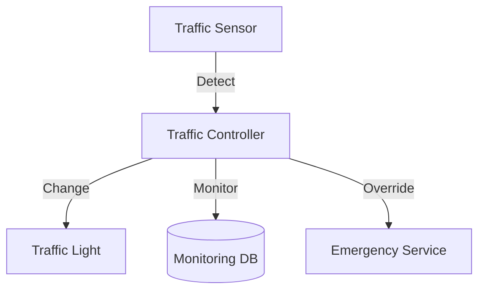

# Traffic Control System: Interview Study Guide

## 1. Conceptual Overview
A traffic control system manages traffic lights, vehicle flow, and timing at intersections. Must be reliable, adaptive, and safe.

---

## 2. Requirements & Constraints
- Control multiple intersections
- Timed and adaptive light changes
- Sensor integration (vehicle detection)
- Emergency override
- Scalability and reliability
- Real-time monitoring

---

## 3. High-Level Architecture Diagram



---

## 4. Core Components & Data Flow
- **Traffic Controller:** Manages light states
- **Traffic Light:** Physical signal
- **Sensor:** Detects vehicles, pedestrians
- **Monitoring DB:** Stores traffic data
- **Emergency Service:** Overrides signals

---

## 5. Example Walkthrough
1. Sensor detects vehicle
2. Controller adjusts light timing
3. Light changes state
4. Emergency vehicle triggers override

---

## 6. Key Algorithms & Data Structures
### State Machine for Light Control
```python
states = ['RED', 'GREEN', 'YELLOW']
current = 'RED'
def next_state():
    # Transition logic
    pass
```

### Scheduling Algorithms
- Fixed time, adaptive (based on traffic)

---

## 7. Scaling, Reliability, and Trade-offs
- **Scalability:** Partition by intersection, distributed controllers
- **Reliability:** Redundant controllers, failover
- **Adaptivity:** Use real-time data for timing

---

## 8. Common Interview Questions
- How to adapt to changing traffic?
- How to handle emergency overrides?
- How to scale for many intersections?
- How to ensure reliability?

---

## 9. Real-World Use Cases
- City traffic lights, smart intersections

---

## 10. Tips for Interviews
- Draw architecture and state diagrams
- Discuss scheduling, sensor integration
- Mention trade-offs (fixed vs adaptive)
- Walk through light change flows

---

## 11. Further Reading
- [Traffic Signal System Design](https://www.geeksforgeeks.org/system-design/design-traffic-signal-system-design/)
- [State Machine](https://en.wikipedia.org/wiki/Finite-state_machine)

---

**Practice, visualize, and explain clearly—this will make you interview ready!**
