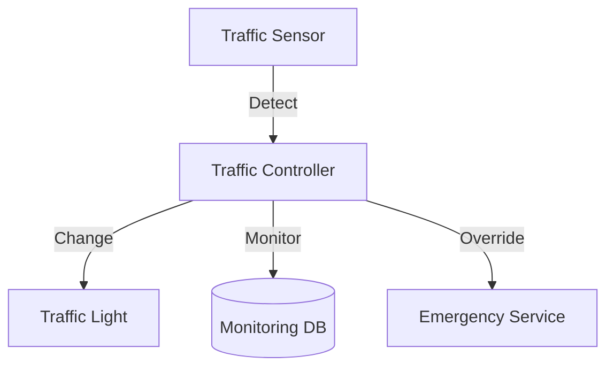

# Traffic Control System: Interview Study Guide

## 1. Conceptual Overview
A traffic control system manages traffic lights, vehicle flow, and timing at intersections. Must be reliable, adaptive, and safe.

---

## 2. Requirements & Constraints
- Control multiple intersections
- Timed and adaptive light changes
- Sensor integration (vehicle detection)
- Emergency override
- Scalability and reliability
- Real-time monitoring

---

## 3. High-Level Architecture Diagram



---

## 4. Core Components & Data Flow
- **Traffic Controller:** Manages light states
- **Traffic Light:** Physical signal
- **Sensor:** Detects vehicles, pedestrians
- **Monitoring DB:** Stores traffic data
- **Emergency Service:** Overrides signals

---

## 5. Example Walkthrough
1. Sensor detects vehicle
2. Controller adjusts light timing
3. Light changes state
4. Emergency vehicle triggers override

---

## 6. Key Algorithms & Data Structures
### State Machine for Light Control
```python
states = ['RED', 'GREEN', 'YELLOW']
current = 'RED'
def next_state():
    # Transition logic
    pass
```

### Scheduling Algorithms
- Fixed time, adaptive (based on traffic)

---

## 7. Scaling, Reliability, and Trade-offs
- **Scalability:** Partition by intersection, distributed controllers
- **Reliability:** Redundant controllers, failover
- **Adaptivity:** Use real-time data for timing

---

## 8. Common Interview Questions
- **How to adapt to changing traffic?**  
    Use sensors to collect real-time vehicle data and adjust signal timings dynamically. Implement adaptive algorithms that respond to traffic density and patterns.

- **How to handle emergency overrides?**  
    Integrate with emergency vehicle detection systems (e.g., siren sensors, radio signals). The controller should preempt normal cycles to give priority to emergency vehicles, then safely resume standard operation.

- **How to scale for many intersections?**  
    Partition the system by intersection or region. Use distributed controllers that communicate with a central monitoring system. Employ scalable messaging and data storage solutions.

- **How to ensure reliability?**  
    Design for redundancy with backup controllers and failover mechanisms. Monitor system health in real time and implement self-healing or alerting for failures.

---

## 9. Real-World Use Cases
- City traffic lights, smart intersections

---

## 10. Tips for Interviews
- Draw architecture and state diagrams
- Discuss scheduling, sensor integration  
    Explain how scheduling algorithms (fixed vs adaptive) determine light changes. Fixed scheduling uses preset intervals, while adaptive scheduling adjusts timings based on real-time sensor data. Sensor integration enables the system to detect vehicles and pedestrians, providing input for adaptive algorithms to optimize flow and reduce wait times.

- Mention trade-offs (fixed vs adaptive)  
    Fixed scheduling is simple and predictable but may cause unnecessary delays during low traffic. Adaptive scheduling improves efficiency by responding to actual traffic conditions but adds complexity and requires reliable sensor data and more sophisticated control logic.
- Walk through light change flows

---

## 11. Further Reading
- [Traffic Signal System Design](https://www.geeksforgeeks.org/system-design/design-traffic-signal-system-design/)
- [State Machine](https://en.wikipedia.org/wiki/Finite-state_machine)

---

**Practice, visualize, and explain clearly—this will make you interview ready!**
