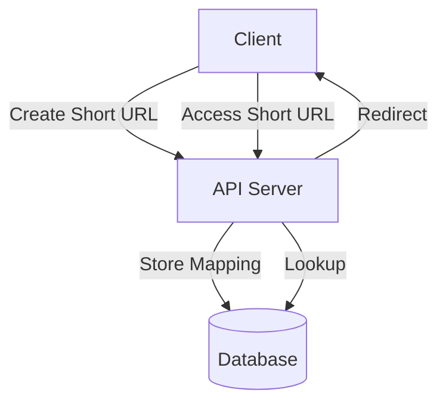

# URL Shortening Service (TinyURL, Bit.ly): Interview Study Guide

## 1. Conceptual Overview
A URL Shortener converts long URLs into short, unique aliases. When a user accesses the short URL, they are redirected to the original long URL. Used for sharing links on social media, SMS, etc.

---

## 2. Requirements & Constraints
- Generate unique short URLs for long URLs
- Redirect short URLs to original URLs
- Handle high traffic and scalability
- Support custom aliases
- Track usage statistics (clicks, creation time)
- Expiry and deletion of URLs
- High availability and reliability

---

## 3. High-Level Architecture Diagram



---

## 4. Core Components & Data Flow
- **API Server:** Handles requests to create and access short URLs
- **Database:** Stores mappings between short and long URLs, stats
- **Hashing/Encoding:** Generates unique short codes (Base62, MD5, etc.)
- **Redirection Logic:** Looks up short code and redirects
- **Custom Alias Handler:** Allows user-defined short URLs
- **Stats Tracker:** Records clicks, timestamps

---

## 5. Example Walkthrough
1. User submits `https://www.example.com/very/long/url`
2. Server generates short code `abc123` (e.g., using Base62)
3. Stores mapping: `abc123` → `https://www.example.com/very/long/url`
4. User shares `https://short.ly/abc123`
5. When accessed, server looks up `abc123` and redirects to original URL

---

## 6. Key Algorithms & Data Structures
### Short Code Generation (Base62)
```python
import string, random
def generate_code(length=6):
    chars = string.ascii_letters + string.digits
    return ''.join(random.choices(chars, k=length))
```

### Mapping Storage
- Use a key-value store (e.g., Redis, SQL DB)
- Table: `short_code`, `long_url`, `created_at`, `clicks`, `custom_alias`, `expiry`

### Redirection
```python
def redirect(short_code):
    long_url = db.get(short_code)
    if long_url:
        return redirect(long_url)
    else:
        return error('Not found')
```

---

## 7. Scaling, Reliability, and Trade-offs
- **Scalability:** Use distributed DB, cache hot URLs, partition by code prefix
- **Reliability:** Replicate DB, use load balancers
- **Custom Aliases:** Check for collisions before assignment
- **Expiration:** Periodic cleanup of expired URLs
- **Analytics:** Store click stats asynchronously

---

## 8. Common Interview Questions

### Answers

**How do you ensure short code uniqueness?**
- Use a counter, hash, or random generator with collision checks.
- Store generated codes in a database and check for duplicates before assignment.
- For custom aliases, validate uniqueness at creation time.

**How to handle collisions in custom aliases?**
- Check for existing aliases before saving.
- Return an error or prompt user to choose a different alias if collision occurs.
- Use transactional database operations to avoid race conditions.

**How to scale for millions of requests?**
- Use caching (e.g., Redis) for frequently accessed URLs.
- Partition/shard the database to distribute load.
- Employ load balancers and replicate services across regions.

**How to expire/delete URLs?**
- Store expiration timestamps with each URL entry.
- Use background jobs to periodically delete expired URLs.
- Allow users to manually delete their URLs.

**How to track and store analytics?**
- Log each redirect event with metadata (IP, timestamp, referrer).
- Use a time-series database or analytics platform for aggregation.
- Provide dashboards for users to view stats.

**How to prevent abuse (e.g., spam URLs)?**
- Implement rate limiting and CAPTCHA for submissions.
- Scan submitted URLs for known spam/malware domains.
- Block or flag suspicious activity and provide moderation tools.

---

## 9. Real-World Use Cases
- Social media sharing
- SMS links
- QR codes
- Marketing campaigns

---

## 10. Tips for Interviews
- Draw architecture diagrams
- Walk through example flows
- **Discuss trade-offs (DB choice, code generation):**  
    Choosing between SQL and NoSQL databases impacts scalability, consistency, and complexity. SQL offers strong consistency and easy relational queries, while NoSQL (like Redis or DynamoDB) provides high scalability and low latency for key-value lookups. For code generation, using random codes is simple but may risk collisions, while sequential or hash-based codes can be more predictable or require extra logic to avoid duplicates.

- **Mention edge cases (collisions, expiry):**  
    Collisions can occur if two URLs generate the same short code, especially with random or hash-based methods. Always check for existing codes before assignment. Expiry is another edge case—expired URLs should not be accessible, so ensure proper cleanup and error handling for expired or deleted entries.

- **Suggest improvements (analytics, abuse prevention):**  
    Enhance analytics by tracking detailed usage stats (e.g., geolocation, device type) and providing user dashboards. To prevent abuse, implement rate limiting, CAPTCHA, and URL validation to block spam or malicious links. Regularly monitor and audit system activity for suspicious behavior.

---

## 11. Further Reading
- [System Design Primer: URL Shortener](https://github.com/donnemartin/system-design-primer/blob/master/solutions/system_design/pastebin/README.md)
- [Base62 Encoding](https://en.wikipedia.org/wiki/Base62)
- [TinyURL Architecture](https://www.geeksforgeeks.org/system-design/system-design-url-shortening-service/)

---

**Practice, visualize, and explain clearly—this will make you interview ready!**
