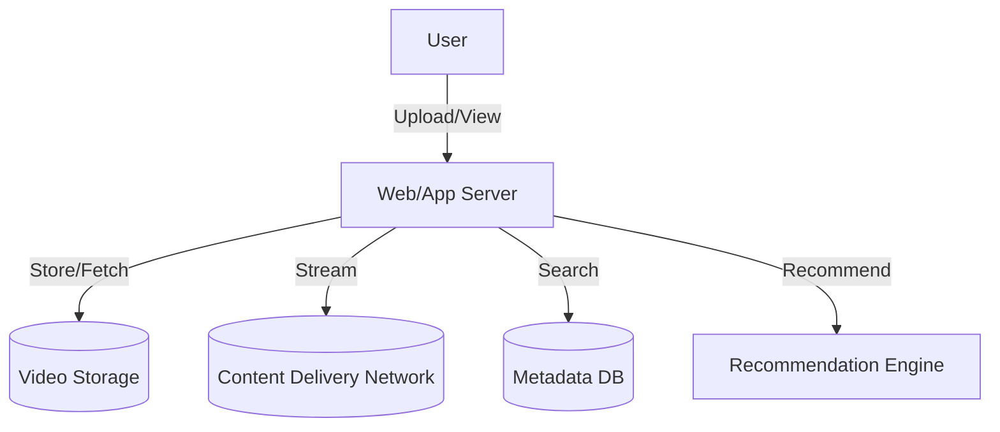

# YouTube/Netflix (Global Video Streaming): Interview Study Guide

## 1. Conceptual Overview
A global video streaming service lets users upload, view, and share videos. It must deliver high-quality streams to millions of users, support search, recommendations, and handle massive data.

---

## 2. Requirements & Constraints
- Upload, store, and stream videos
- Support millions of concurrent viewers
- Search, recommendations, comments, likes
- Adaptive bitrate streaming
- High availability, low latency
- Scalable storage and bandwidth
- Content moderation and copyright handling

---

## 3. High-Level Architecture Diagram



---

## 4. Core Components & Data Flow
- **Web/App Server:** Handles user requests
- **Video Storage:** Stores raw and encoded videos
- **CDN:** Delivers videos globally, caches popular content
- **Metadata DB:** Stores video info, user data, comments
- **Transcoder:** Converts uploads to multiple bitrates
- **Recommendation Engine:** Suggests videos

---

## 5. Example Walkthrough
1. User uploads video
2. Transcoder creates multiple resolutions
3. Metadata stored in DB
4. Video distributed to CDN
5. User requests video; CDN streams closest copy

---

## 6. Key Algorithms & Data Structures
### Adaptive Bitrate Streaming
- Use HLS/DASH protocols
- Store video in chunks of different bitrates
- Client switches bitrate based on network speed

### Recommendation (Collaborative Filtering)
```python
# Simplified collaborative filtering
user_history = {...}
def recommend(user_id):
    # Find similar users, suggest their liked videos
    pass
```

---

## 7. Scaling, Reliability, and Trade-offs
- **Scalability:** Use distributed storage, CDN, sharding
- **Reliability:** Replicate data, monitor health
- **Latency:** Pre-cache popular videos, use edge servers
- **Copyright:** Automated content scanning

---

## 8. Common Interview Questions
- How to scale for millions of users?
- How to handle video uploads and transcoding?
- How to deliver low-latency streams globally?
- How to recommend videos?
- How to moderate content?

### Answers

**How to scale for millions of users?**
- Use CDN (Content Delivery Network) to cache and deliver video content close to users.
- Employ microservices for different functionalities (upload, streaming, analytics).
- Auto-scale infrastructure based on demand and use load balancers.

**How to handle video uploads and transcoding?**
- Store uploads in object storage (e.g., S3) and queue jobs for transcoding.
- Use distributed workers to transcode videos into multiple formats/resolutions.
- Notify users when transcoding is complete and video is ready.

**How to deliver low-latency streams globally?**
- Use adaptive bitrate streaming (HLS/DASH) to adjust quality based on network.
- Distribute content via global CDNs and edge servers.
- Monitor latency and optimize routing for real-time delivery.

**How to recommend videos?**
- Use collaborative filtering, content-based filtering, or hybrid recommendation algorithms.
- Track user interactions and preferences for personalized suggestions.
- Continuously update models with new data.

**How to moderate content?**
- Use automated tools (AI/ML) to flag inappropriate content.
- Provide reporting mechanisms for users.
- Employ human moderators for review and escalation.

---

## 9. Real-World Use Cases
- YouTube, Netflix, Twitch, Vimeo

---

## 10. Tips for Interviews
- Draw architecture and data flow diagrams
- Discuss CDN, adaptive streaming, scaling
- Mention trade-offs (cost, latency, copyright)
- Walk through upload and playback flows

---

## 11. Further Reading
- [YouTube System Design](https://www.geeksforgeeks.org/system-design/system-design-of-youtube-a-complete-architecture/)
- [Netflix Architecture](https://www.geeksforgeeks.org/system-design/system-design-netflix-a-complete-architecture/)
- [HLS Streaming](https://developer.apple.com/streaming/)

---

**Practice, visualize, and explain clearly—this will make you interview ready!**
