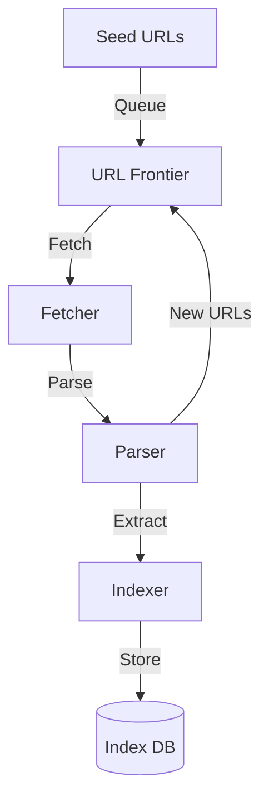

# Web Crawler: Interview Study Guide

## 1. Conceptual Overview
A web crawler automatically browses the web to index content for search engines. Must be scalable, efficient, and respectful of site policies.

---

## 2. Requirements & Constraints
- Discover and fetch web pages
- Parse and index content
- Handle millions of URLs
- Respect robots.txt and rate limits
- Prioritize fresh and important pages
- Scalability and reliability

---

## 3. High-Level Architecture Diagram

---

## 4. Core Components & Data Flow
- **URL Frontier:** Queue of URLs to crawl
- **Fetcher:** Downloads web pages
- **Parser:** Extracts links and content
- **Indexer:** Stores parsed data
- **Index DB:** Stores indexed content

---

## 5. Example Walkthrough
1. Start with seed URLs
2. Fetcher downloads page
3. Parser extracts links, adds to frontier
4. Indexer stores content
5. Repeat for new URLs

---

## 6. Key Algorithms & Data Structures
### URL Frontier (Queue)
- Use priority queue for freshness/importance

### Politeness & Rate Limiting
- Respect robots.txt
- Limit requests per domain

---

## 7. Scaling, Reliability, and Trade-offs
- **Scalability:** Distribute fetchers, partition by domain
- **Reliability:** Retry failed fetches, monitor health
- **Freshness:** Prioritize frequently updated sites

---

## 8. Common Interview Questions
- How to scale crawling for billions of pages?
- How to avoid overloading sites?
- How to prioritize URLs?
- How to store and index content efficiently?

---

## 9. Real-World Use Cases
- Googlebot, Bingbot, DuckDuckGo, SEO tools

---

## 10. Tips for Interviews
- Draw architecture and data flow diagrams
- Discuss URL frontier, rate limiting, indexing
- Mention trade-offs (freshness, politeness, scale)
- Walk through crawl and index flows

---

## 11. Further Reading
- [Web Crawler System Design](https://www.geeksforgeeks.org/system-design/design-web-crawler-system-design/)
- [Robots.txt Protocol](https://en.wikipedia.org/wiki/Robots_exclusion_standard)
- [Search Engine Architecture](https://en.wikipedia.org/wiki/Web_search_engine)

---

**Practice, visualize, and explain clearly—this will make you interview ready!**
