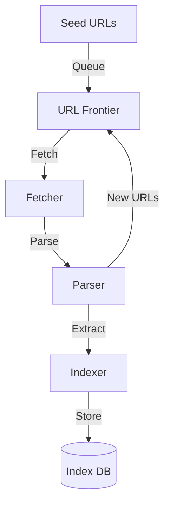

# Web Crawler: Interview Study Guide

## 1. Conceptual Overview
A web crawler automatically browses the web to index content for search engines. Must be scalable, efficient, and respectful of site policies.

---

## 2. Requirements & Constraints
- Discover and fetch web pages
- Parse and index content
- Handle millions of URLs
- Respect robots.txt and rate limits
- Prioritize fresh and important pages
- Scalability and reliability

---

## 3. High-Level Architecture Diagram

---

## 4. Core Components & Data Flow
- **URL Frontier:** Queue of URLs to crawl
- **Fetcher:** Downloads web pages
- **Parser:** Extracts links and content
- **Indexer:** Stores parsed data
- **Index DB:** Stores indexed content

---

## 5. Example Walkthrough
1. Start with seed URLs
2. Fetcher downloads page
3. Parser extracts links, adds to frontier
4. Indexer stores content
5. Repeat for new URLs

---

## 6. Key Algorithms & Data Structures
### URL Frontier (Queue)
- Use priority queue for freshness/importance

### Politeness & Rate Limiting
- Respect robots.txt
- Limit requests per domain

---

## 7. Scaling, Reliability, and Trade-offs
- **Scalability:** Distribute fetchers, partition by domain
- **Reliability:** Retry failed fetches, monitor health
- **Freshness:** Prioritize frequently updated sites

---

## 8. Common Interview Questions
- **How to scale crawling for billions of pages?**  
    Distribute crawling across multiple machines using sharding (e.g., partition by domain or URL hash). Use distributed queues and storage. Employ load balancing and horizontal scaling for fetchers and parsers.

- **How to avoid overloading sites?**  
    Respect `robots.txt` rules and implement per-domain rate limiting. Track request frequency per domain and introduce delays as needed. Use politeness policies to avoid sending too many requests to the same server.

- **How to prioritize URLs?**  
    Use a priority queue in the URL frontier, ranking URLs by freshness, importance, or update frequency. Assign higher priority to frequently updated or high-value pages.

- **How to store and index content efficiently?**  
    Use scalable storage solutions like distributed databases or search engines (e.g., Elasticsearch, Cassandra). Store raw and parsed content separately. Index content incrementally and use compression to save space.

---

## 9. Real-World Use Cases
- Googlebot, Bingbot, DuckDuckGo, SEO tools

---

## 10. Tips for Interviews
- Draw architecture and data flow diagrams
- Discuss **URL frontier, rate limiting, indexing:**  
    The URL frontier manages the queue of URLs to be crawled, often using a priority queue to ensure important or frequently updated pages are crawled first. Rate limiting ensures the crawler does not overload any single website by controlling the frequency of requests per domain and adhering to robots.txt rules. Indexing involves parsing fetched pages and storing their content in a searchable format, enabling efficient retrieval and analysis.

- Mention **trade-offs (freshness, politeness, scale):**  
    Crawlers must balance freshness (how up-to-date the indexed content is), politeness (not overwhelming servers and respecting site policies), and scale (handling billions of pages efficiently). Improving one aspect often impacts the others; for example, increasing crawl frequency improves freshness but may reduce politeness if not carefully managed.
- Walk through crawl and index flows

---

## 11. Further Reading
- [Web Crawler System Design](https://www.geeksforgeeks.org/system-design/design-web-crawler-system-design/)
- [Robots.txt Protocol](https://en.wikipedia.org/wiki/Robots_exclusion_standard)
- [Search Engine Architecture](https://en.wikipedia.org/wiki/Web_search_engine)

---

**Practice, visualize, and explain clearly—this will make you interview ready!**
